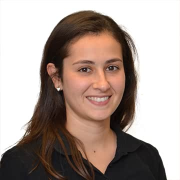
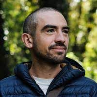
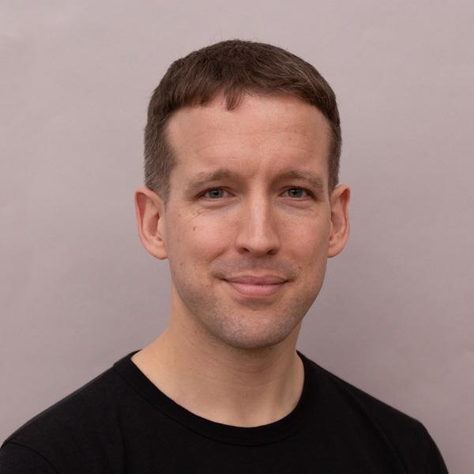

# **The CLIMB team**

CLIMB is led by an experienced team of researchers and computational experts from leading UK institutions:

---

{width="300"}

# **Nick Loman**

## **CLIMB Director**

---

{width="300"}

# **Lisa Marchioretto**

## **Operations Manager**

---

{width="300"}

# **Radoslaw Poplawski**

## **Technical Lead**

---

{width="300"}

# **Andrew Smith**

## **Research Software Engineer**

---

{width="300"}

# **Leo Turnell-Ritson**

## **Research Software Engineer**

---

{width="300"}

# **Michaela Matthews**

## **Bioinformatician and User Support Manager**

---

{width="300"}

# **Sam Wilkinson**

## **Bioinformatician**

---

{width="300"}

# **Tom Paine**

## **Cloud Engineer**

---

{width="300"}

# **Andrea Telatin**

## **QIB - Head of Informatics**

---

{width="300"}

# **Sam Haynes**

## **QIB - Core Bioinformatics**

---

{width="300"}

# **Kalon Grimes**

## **QIB - Core Bioinformatics**

---

# **Operational Committee**

The CLIMB Team is supported by an Operational Committee.