# **Registration**

---

To gain access to CLIMB resources and services, team and user registration is required.

This page will guide you through team registration and management with the following sections:

+ [**Who can register ?**](3.1.registration.md#who-can-register)
+ [**Primary user registration**](3.1.registration.md#primary-user-registration)
+ [**Team management**](3.1.registration.md#team-management)
+ [**Member roles**](3.1.registration.md#member-roles)
+ [**Register for new team**](3.1.registration.md#register-for-new-team)
+ [**Project management**](3.1.registration.md#project-management)

---

## **Who can register ?**

We divide users into three categories:

+ **Primary users**: Those with salaried positions in UK academic institutions, government agencies or healthcare systems who have the status of independent researchers and/or team leaders. These users must hold a **ac.uk**, **gov.uk** or **nhs.uk** email account.
+ **Secondary users**: Those working under the direction of primary users who include students, post-doctoral researchers and overseas collaborators. 
+ **Industrial users**: Users in industry should contact us to discuss terms and conditions for industrial users.

!!! warning
    Please note: **only primary users should register to create a new team**. Secondary users will need to be invited by a primary user to gain access to CLIMB's resources.

For both Primary and Secondary users, account authentication will need to be setup when you first log in. See the [**Authentication page**](3.2.authentication.md) for more information.

---

## **Primary user registration**

When you head over to the [**Bryn registration page**](https://bryn.climb.ac.uk/user/register/), you should see the registration form:

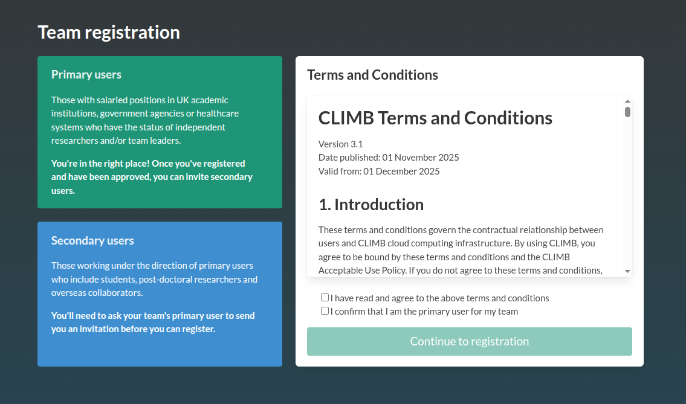

Accept the [**terms**](../1.Overview/1.1.T&Cs.md) if you are happy, and you will then be asked information regarding your **Primary user details** including contact information and your position. You will also be asked about your **Team details** for your CLIMB team account. This includes information on where you currently work and why you would like to use CLIMB's resources.

The registration request will be reviewed by a member of our management team. Please provide as much information as possible about your role and research to speed up the process. If we do not feel enough information has been provided, we may contact you. If your registration is successful, you will receive a verification email. Following verification, you will be taken to the [**Bryn portal**](https://bryn.climb.ac.uk/).

!!! info
    Please note: primary users will be required to **accept a group licence**. This licence will be valid either until your trial period ends or when your paid package has expired. When your licence expires, your access to resources will be blocked. Licences will be renewed after each new paid service.

---

## **Team management**

Once logged into Bryn, the primary user can invite secondary users to join their team via the **Team** section on the left hand side or click the **Team information** at the bottom of the JupyterLab dashboard. 

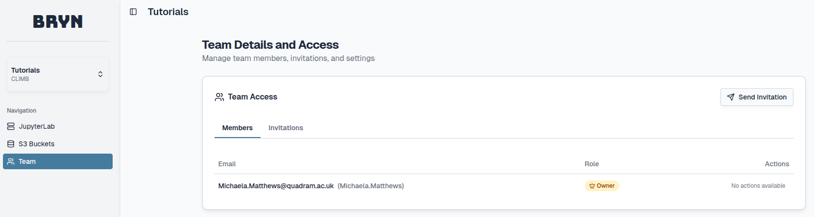

Here, select the **Send invitation** button at the top right, an email address can be inserted with an optional message:

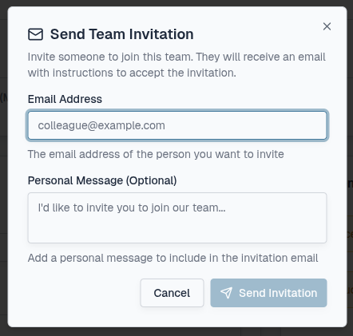

Pending invitations can be viewed under the **Invitations** tab.

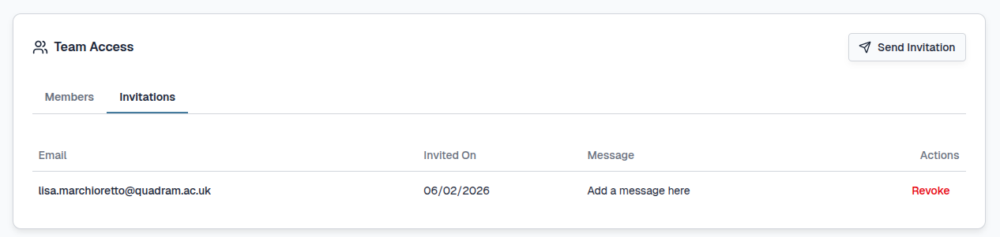

You can revoke the invitation which will not allow the link to work any longer by selecting the **Revoke** button under Actions:

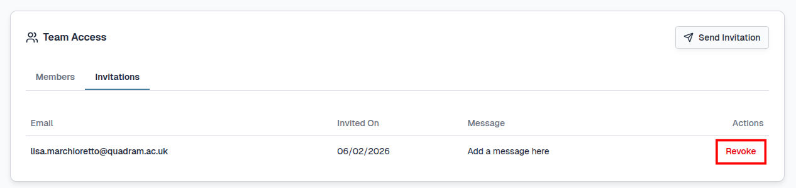

You will need to confirm the change by selecting the **Revoke Invitation** button:

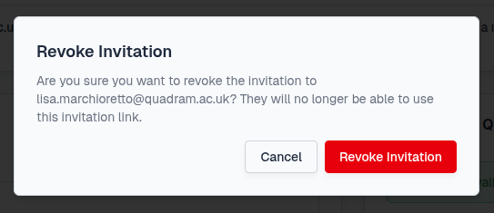

Once the invitation is accepted/revoked, the Invitations tab will update:

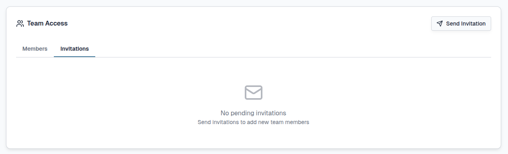

The number of pending Invitations are displayed in the **Team Information** section under the **JupyterLab** section.

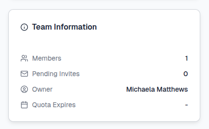

Once an invitation has been accepted, the new user will be visible under the **Members** tab. Here you can manage secondary users and their **roles within the team**.

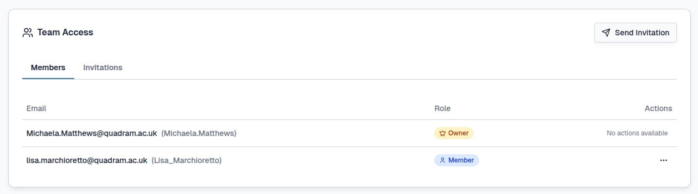

---

## **Member roles**

|    Role   | Team management            | Licence reminders                          |
| :---------- | :----------------------------------- |:-----------------------------------
|  |      |       |
|  |       |       |
| |   |      |

By default, the primary user will be the **Owner** of the team and secondary users will have the **Member** role.

Multiple users can receive the **Admin** role to also receive administrative rights. The **Owner** of a team can promote a secondary user to the **Admin** role by selecting the **...** and **Promote to Admin** buttons under Actions:

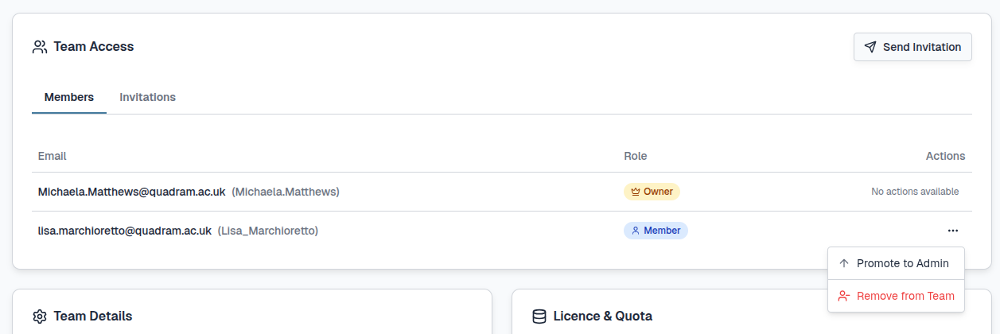

You must confirm this change in roles by selecting the **Promote** button:

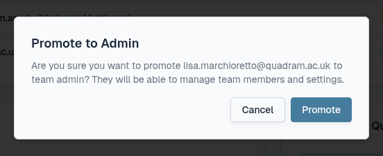

Admins can be demoted back to the Member role by selecting the **...** and **Demote to Member** buttons under Actions:

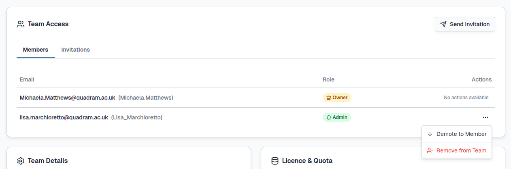

You must confirm this change in roles by selecting the **Demote** button:

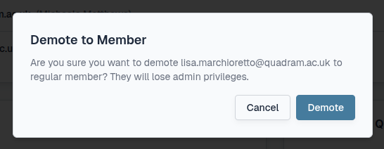

!!! tip
    You can have as many members as you wish within a team but your resource quota will need to be managed effectively. 

    The number of JupyterLab environments available is dependant on your **quota** and **team size**. Individual users can launch one JupyterLab environment (2-8 vCPUs) each and multiple JupyterLab environments are possible within a team depending on the size selected.

    If your team quota is 14 vCPUs, you could have three concurrent 4-vCPU JupyterLab environments or one 8-vCPU, one 4-vCPU and one 2-vCPU.

---

## **Register for new team**

For some primary users, you may wish to create a new team with a different resource quota allocation for collaborative purposes. In this instance you 
can register for a new CLIMB team by any of the following:

1) Before you login select the **Register** button at the top right of the screen:

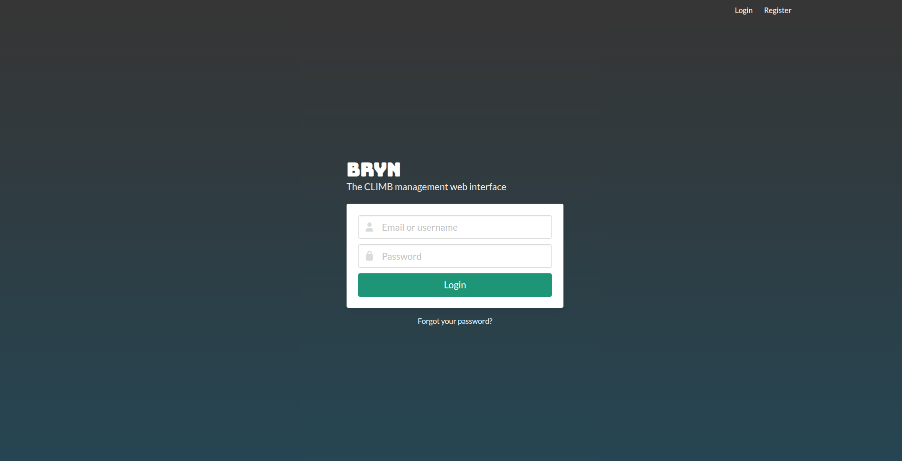

2) Once you login select the **Register new team** button at the bottom right of the screen:

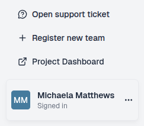

3) Use the following [**link**](https://bryn.climb.ac.uk/user/register/).

Please provide as much information as possible during the team registration process and [**contact us**](mailto:climb@quadram.ac.uk) to discuss your options.

---

## **Project management**

For some users or organisations, having full administrative control over multiple teams can be enabled. For this a **dedicated CLIMB Project** can be set up. Within a Project, multiple teams can be created and managed.

For all other users, CLIMB is the default Project which is managed by the CLIMB Team.

For more information on CLIMB Projects, please [**contact us**](mailto:climb@quadram.ac.uk) and see our [**Project page**](../4.Documentation/4.3.Projects/projects.md).

---

# **What is next ?**

Once your team is set up you can explore [**Bryn**](3.3.bryn.md) and [**CLIMB resources**](../4.Documentation/index.md) to begin your research.

