# **Account authentication**

---

All CLIMB resources are accessed via the [**Bryn web interface**](https://bryn.climb.ac.uk/account/login/).

There are multiple authentication routes to access your CLIMB account.

This page will guide you through account authentication with the following sections:

+ [**Password**](3.2.authentication.md#password)
+ [**Two-factor authentication**](3.2.authentication.md#two-factor-authentication)
+ [**Backup recovery codes**](3.2.authentication.md#backup-recovery-codes)
+ [**SMS Two step login**](3.2.authentication.md#sms-two-step-login)
+ [**Managing two-factor authentication**](3.2.authentication.md#managing-two-factor-authentication)

---

## **Password**

When you first create your account, you will have created a password. You can login to bryn using the email address you supplied when you setup the account and this password.

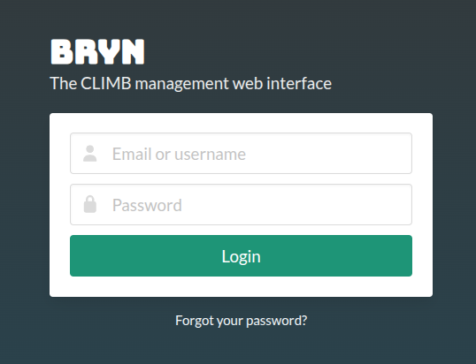

If you forget your password, you can select the **Forgot your password?** button at the bottom of the panel:


You will be prompted to enter the email address you supplied when you setup the account:

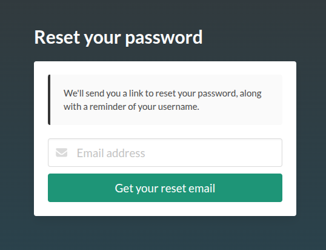

You will receive an email from **noreply@climb.ac.uk** to reset your password along with your account username.

---

## **Two-factor authentication**

Two-factor authentication (2FA) is mandatory, and users will be required to set this up on first login. This means that a code will be required from an authenticator app on a mobile or desktop device, in addition to your password.

!!! info
    If using the same browser and device, you will only be required to enter this **every 30 days**.

**Initial setup**

When you first login to your account, authentication will need to be set up. You will be presented with the following:

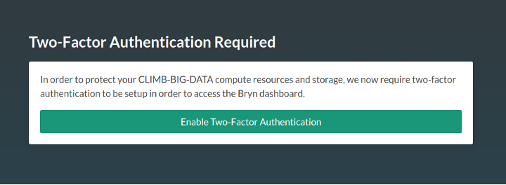

Select **Enable Two-Factor Authentication** and proceed to follow the instructions. You will be prompted to install an authenticator app on your mobile device. Our current recommendations (in order) are:

+ [**Authy**](https://support.authy.com/hc/en-us/articles/115001945848-Downloading-and-Installing-Authy-Apps) (Desktop app available)
+ [**Microsoft Authenticator**](https://www.microsoft.com/en-us/security/mobile-authenticator-app)
+ [**Google Authenticator**](https://googleauthenticator.net/)

!!! info
    Authy and Microsoft Authenticator make it easier to backup and recover your codes in the case of loss or change of device, whereas Google requires a manual export/import. **Please do enable backups for your app at this stage, before you forget !**

**Authy backups**

Authy has a backup feature to enable recovery in case you lose or replace your phone. Your data is encrypted and only decrypted on the devices using a password that only you will know. See the [**Authy documentation**](https://authy.com/blog/how-the-authy-two-factor-backups-work/) for further details.

**Microsoft Authenticator backups**

See the [**Microsoft documentation**](https://support.microsoft.com/en-us/account-billing/back-up-and-recover-account-credentials-in-the-authenticator-app-bb939936-7a8d-4e88-bc43-49bc1a700a40) for details on how to enable this.

**Scanning the QR code**

In all authenticator apps, the default way to add an app is to scan a QR code. Bryn will present the code for you to scan and ask you to enter the generated token before it expires (every 30s). If it does expire while you are typing, just enter the new one.

Congratulations, two-factor authentication is now enabled!

**Logging in to Bryn after 2FA is set up**

When you next login to Bryn, after entering your username and password, a **6 digit code** will be requested from your 2FA device:

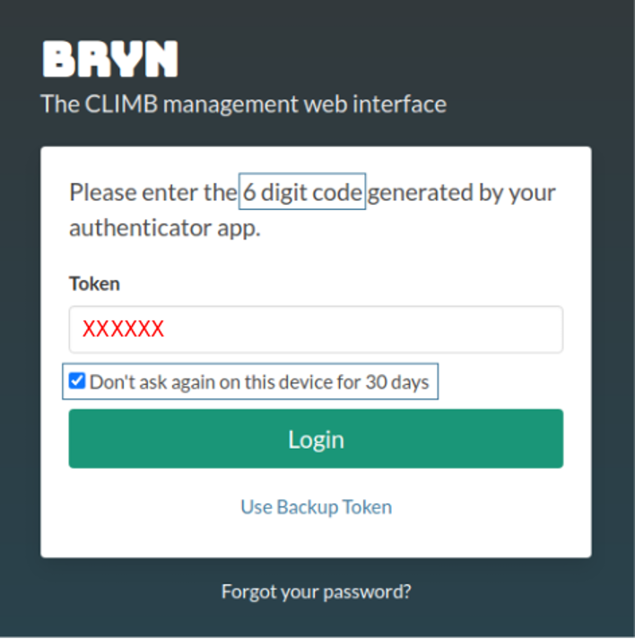{ width=350 }

If you wish, mark the check box **Don't ask again on this device for 30 days**. If selected, once the 30 days have passed, you will need to provide a new 6 digit code to authenticate your account. Otherwise you will need to repeat this step every time you login.

---

## **Backup recovery codes**

You will now have the option to generate backup recovery codes. This is a list of **single-use** codes that enable you to gain access in the event of the loss of your device. **This is strongly recommended**.

Follow the link to **setup your backup codes** as seen in the screenshot below:

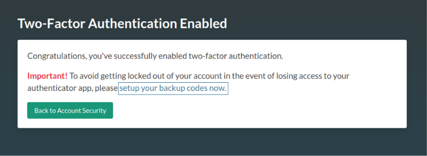{ width=600 }

Next, select the **Generate tokens** button:

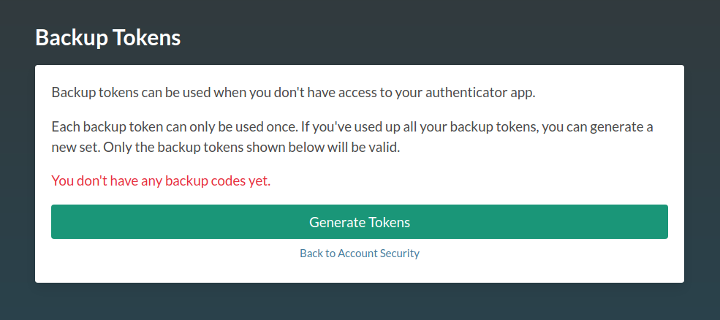{ width=600 }

!!! tip
    Print, save or otherwise make a note of these codes and **keep them in a secure place**.

You can now proceed to the [**Bryn dashboard**](https://bryn.climb.ac.uk/).

**Using one of your backup tokens**

If you don't have your device to hand, or you've lost it, you can use a **single-use** backup token.

To use a backup token, follow the **Use Backup Token** link as seen below:

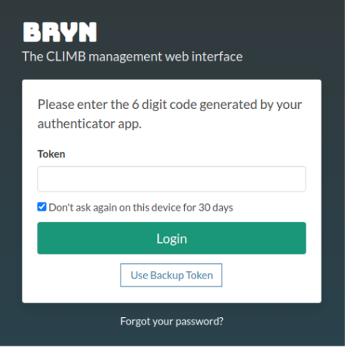{ width=350 }

Once you have used all of your tokens, you will need to create more. See the [**Managing two-factor authentication**](3.2.authentication.md#managing-two-factor-authentication) section for how to do this.

---

## **SMS Two step login**

When you login to bryn you will be notified to set up SMS. You can either select **Setup SMS Now** or **Skip** button if you do not wish to start the SMS process. You can setup SMS later, see the [**Managing two-factor authentication**](3.2.authentication.md#managing-two-factor-authentication) section for how to do this.

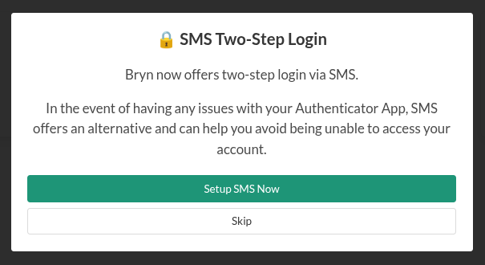

Provide a mobile number and select **Continue** to receive a token via SMS:

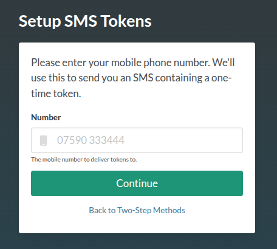

A **one-time** token will be sent from **Bryn** to the number you provide:

```Your Bryn OTP token is xxxxxx```

An OTP token is a **one-time token**. You cannot use it more than once. You will have **60 seconds** to add and submit the token with the **Verify token** button:

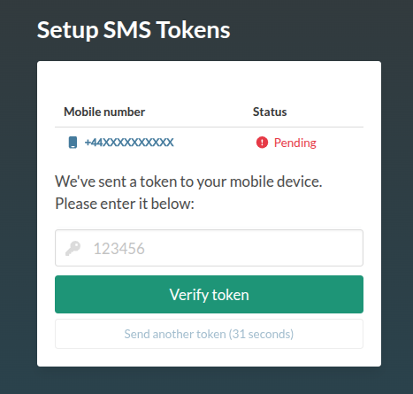

If you do not use the token within the 60 seconds, a new token will need to be sent using the **Send another token** button.

---

## **Managing two-factor authentication**

When logged in to the Bryn dashboard, you can manage your authentication through your **CLIMB user profile**. You can access your profile by selecting the tab at the bottom left of the dashboard:


To open your user profile select **...** and **Profile**:


Here you can manage your account and any authentication you have set up. The dashboard is split into 2 sections; Profile Information and Security:


**1. Profile Information:** 

A summary of the details provided when you first registered for a CLIMB account.


Here you can update your email address but this will **require verification**.

**2. Security:** 

Here, you can view or generate your backup codes and disable 2FA (for example you wish to use a different device or app).


### **Two-Factor Authentication**

To manage your authentication, select the **Manage 2FA Settings** button:


This will redirect you to view all authentication options currently set-up through your account:

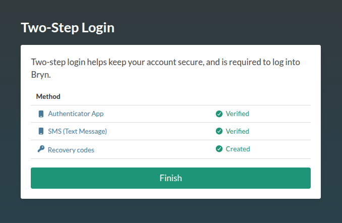

**Authenticator App**

If you wish to change your device or app, you'll need to disable your current two-factor authentication.

!!! warning
    This will log you out and **restart the authentication process**. If you are only changing device, the best option is to use the backup/recovery method for your authenticator app.

If you are sure you'd like disable your authenticator app, hit the **Disable Authenticator App** button:

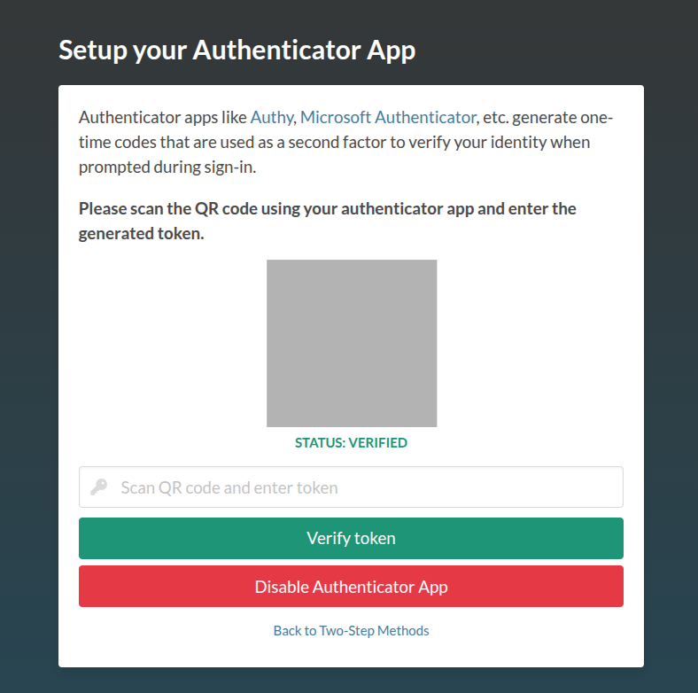

You will need to confirm that you are happy to restart the 2FA process by selecting the **Disable Authenticator App** button:

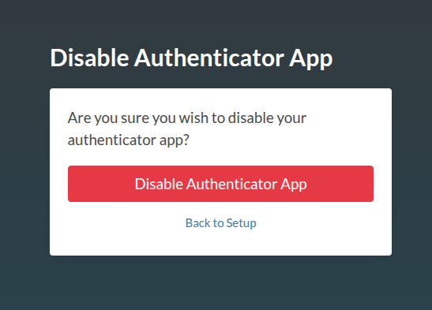

Once you have confirmed, you will be logged out of bryn. Log back in to restart the 2FA setup process with your new app or device following the steps mentioned above.

**SMS**

To disable your SMS codes/tokens, select the **Disable SMS Tokens** button:

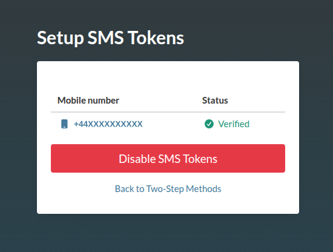

**Recovery codes**

To generate new recovery codes, select the **Generate recovery codes** button:

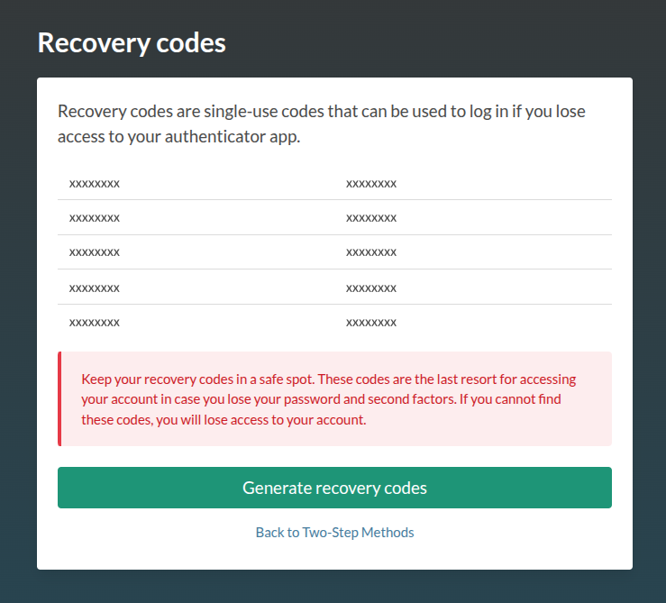

For all authentication options, to return to the authentication management, select the **Back to Two-Step Methods** button.

To return back to your team dashboard select the **Return** button.


### **Password**

Within this section you can also change your password.

Select the **Reset Password** button which will redirect you as mentioned in the [Password section](3.2.authentication.md#password).


---

## **Frequently Asked Questions**

+ **I can no longer access my 2FA device or phone, and I can't recover from a backup**

    If you are still logged in to Bryn, follow the steps in **Managing two-factor authentication**. Otherwise, please contact our support team at [**support@climb.ac.uk**](mailto:support@climb.ac.uk).

+ **Why are my authenticator codes not working?**

    If you have setup your authentication but the 6-digit code does not work, you may need to check that the time on your device is set to auto-sync. Without this setting, the time on the device and server will not match and the codes will not work. This may be a term such as: "Use network provided time/time-zone".

+ **Why are my backup codes not working?**

    You will only have 10 backup codes to use. Once they have been used up, you will not be able to access your account. These are to be used when either the app/desktop authenticators do not work. To check your codes and how many you have left, please see **Managing two-factor authentication**.

+ **I have the authenticator app, why won't it let me scan anything?**

    If you are not prompted to scan the QR code, you may need to change the permissions for the app to access your camera.

+ **I don't have a smart phone, how do I login?**

    There are desktop versions of authenticators that you can use, such as Authy or use the SMS option.
