# **The Bryn interface**

---

[**Bryn**](https://bryn.climb.ac.uk) is the web interface for CLIMB and is the primary way to access the infrastructure.
From Bryn, you can manage your team and the teams' resources.

!!! tip
    As of 1st April 2026, the bryn dashboard has gone through some **major upgrades** with a brand new look ! To get familiar with the new layout and features please read the sections below.

This page will guide you through the new interface with the following sections:

+ [**The Bryn dashboard**](3.3.bryn.md#the-bryn-dashboard)
+ [**JupyterLab**](3.3.bryn.md#jupyterlab)
+ [**S3 Buckets**](3.3.bryn.md#s3-buckets)
+ [**Team**](3.3.bryn.md#team)
+ [**Expanding resource**](3.3.bryn.md#expanding-resource)
+ [**User profile**](3.3.bryn.md#user-profile)
+ [**Access to Support**](3.3.bryn.md#access-to-support)

---

## **The Bryn dashboard**

When you first log in to **bryn**, you will see the new Bryn interface with a **JupyterLab Environment** dashboard.

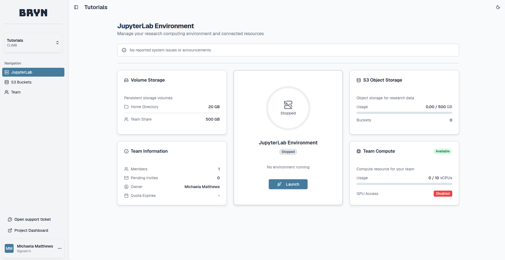

On the top left you can find the following features:

**Current Team and Project** - If you are part of multiple teams, you can switch between team dashboards using this drop down menu.

**Navigation**

+ [**JupyterLab:**](3.3.bryn.md#jupyterlab) Here you can see announcements, a summary of your team and it's resources and access **JupyterLab**.
+ [**S3 Buckets:**](3.3.bryn.md#s3-buckets) Here you can create and manage your **S3 buckets**.
+ [**Team:**](3.3.bryn.md#team) Here you can manage your team and it's members.

Each navigation tab and it's features will be described below.

On the bottom left you can find the following features:

**Open support ticket** - Request support from our Team.

**Register New Team** - If required, register for a new CLIMB Team.

**Project Dashboard** - This is a package specific feature and only relevant for Project users.

**User profile** - You can access your account details and sign out at the bottom left of the dashboard.

---

## **JupyterLab**

This dashboard provides a summary of the resource you have access to based on your current package and quota. The dashboard is split into six sections; Announcements, Volume Storage, JupyterLab environment, S3 Object Storage, Team Information and Team Compute.

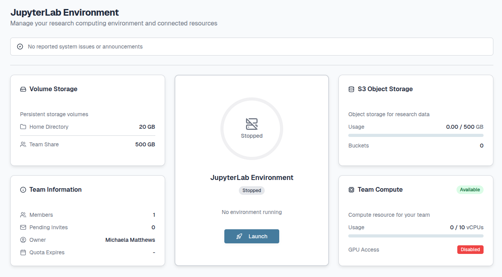

**1. Announcements:** 

The CLIMB team will occasionally send important updates on the service or infrastructure.

Each announcement will appear slightly differently depending on the announcement category, with more recent announcements prioritised:

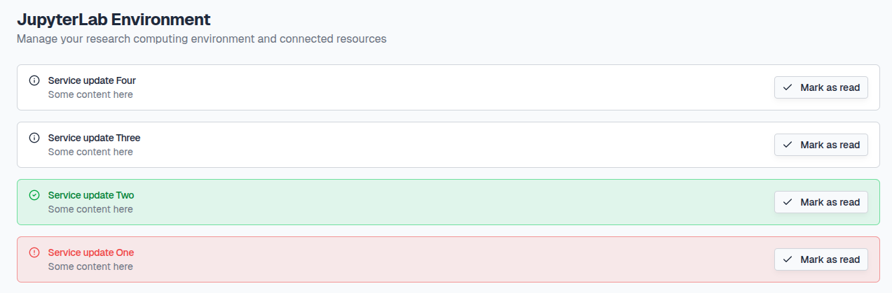

**Service Outage:** Red banner for infrastructure outages and maintenance downtime.

**Service Restored:** Green banner for infrastructure restoration.

**Service Info and News:** White banner for general updates on the service.

!!! info
    We aim to provide at least 2 weeks notice of infrastructure downtime where possible. Please make sure to check your dashboard announcements regularly to stay in the loop !  

You can minimise announcements by clicking the **Mark as read** button.

To open the announcements again, click the **[N] announcements marked as read** button.

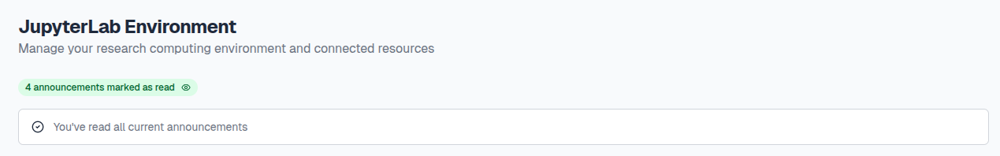

**2. Volume Storage:** 

A summary of the persistent storage (Home Directory and Team Share) available for your team. 

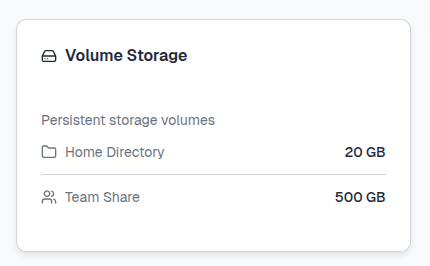

For more information on the different types of storage we offer and how to use them see our [**Storage page**](../4.Documentation/4.2.Storage/index.md).

**3. JupyterLab environment:** 

Here you can launch and access **JupyterLab environments**.

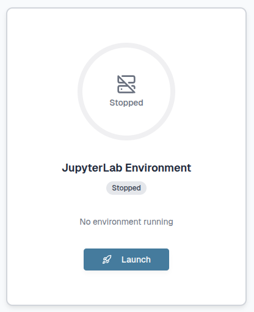

For more information on what JupyterLab environments are and how to use them see our [**JupyterLab page**](../4.Documentation/4.1.JupyterLab/index.md).

**4. S3 Object Storage:** 

A summary of the S3 bucket storage available for your team.

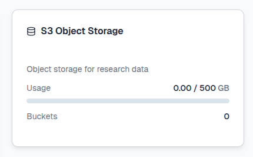

If you click on the tile you can navigate to the [**S3 Buckets section**](3.3.bryn.md#s3-buckets).

**5. Team Information:** 

A summary of your team and it's members.

If you click on the tile you can navigate to the [**Team section**](3.3.bryn.md#team).

**6. Team Compute:** 

A summary of the vCPUs/GPUs available for your team.

This will appear as **Unavailable** at first:

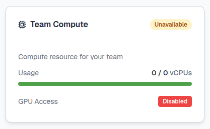

However, once a JupyterLab environment is launched for the first time, the tile will update with the **Available status**.

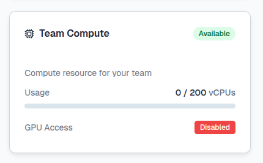

---

## **S3 Buckets**

Here you can create and manage your **S3 buckets**. S3 (Simple Storage Service) buckets are **cloud storage containers** provided by Amazon Web Services (AWS).

 

For more information on what S3 buckets are and how to use them see our [**Storage page**](../4.Documentation/4.2.Storage/index.md).

---

## **Team**

Here you can manage your team and it's members. The dashboard is split into 3 sections; Team Access, Team Details and Licence & Quota.

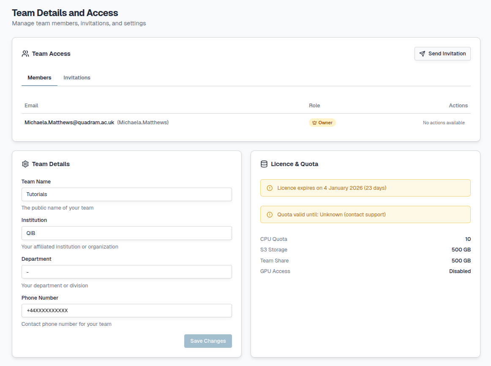

**1. Team Access:** 

A summary of the members of your team with their roles and any pending invitations.

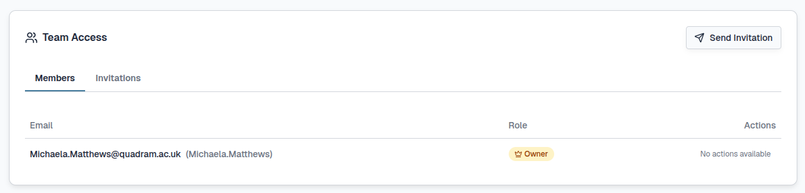

**2. Team Details:** 

A summary of the details provided when you first registered for the Team. This can be updated and confirmed by clicking the **Save Changes** button at the bottom right of the tile.

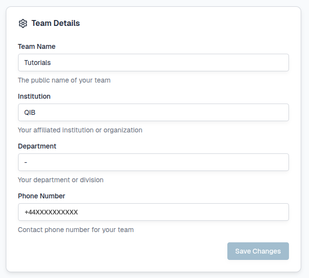

**3. Licence & Quota:**

Here you can see information on your current licence and Team Quota including the total amount of resource (vCPU/GPU) and Storage (S3/Team Share) you have access to.

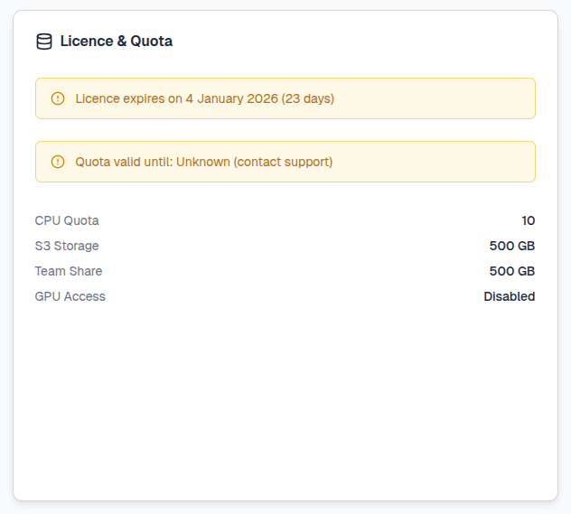

!!! info
    Your licence will cover the period of time which you have paid for or if you are using our trial package, the licence will cover up to 4 months of CLIMB usage. This will need to be renewed each time a package is paid for or extended.

For more information on Teams and Team management see the [**Registration page**](3.1.registration.md).

---

## **Expanding resource**

See our [**Pricing page**](../2.Pricing/index.md) for more information on expanding your quota and [**contact us**](mailto:climb@quadram.ac.uk) to discuss what CLIMB can offer.

!!! failure "Legacy features"
    We no longer support legacy features such as VMs and Volumes.

---

## **User profile**

You can access your **CLIMB user profile** by selecting the tab at the bottom left of the dashboard:

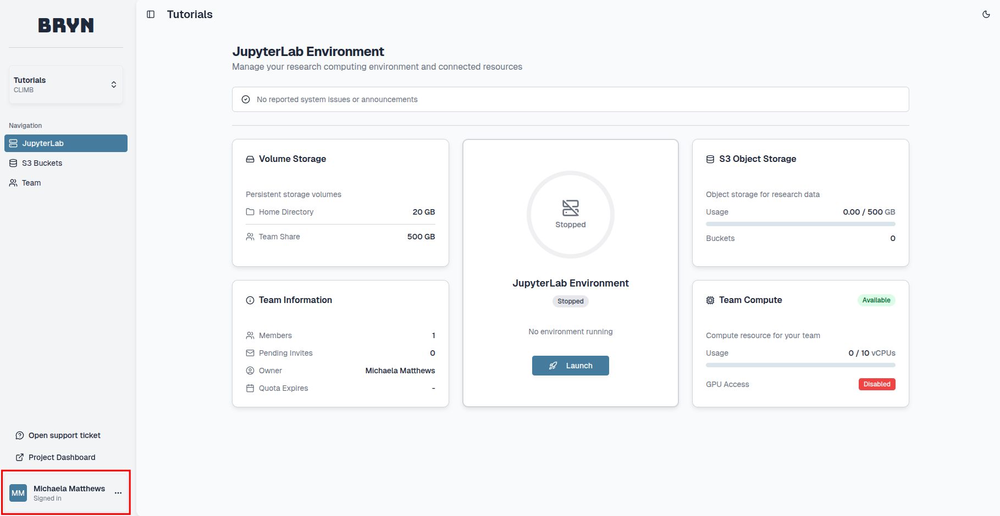

Here you have the option to sign out of your account or can select **Profile**:

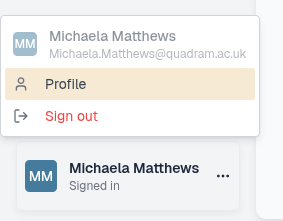

Within your user profile you can manage your account and any authentication you have set up. The dashboard is split into 2 sections; Profile Information and Security:

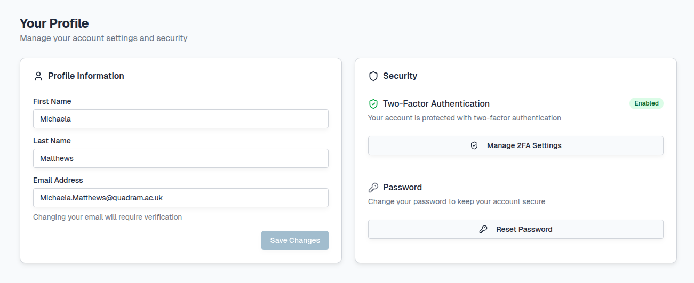

**1. Profile Information:** 

A summary of the details provided when you first registered for a CLIMB account.

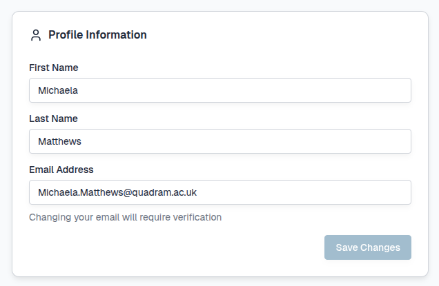

Here you can update your email address but this will **require verification**.

**2. Security:** 

Here, you can view or generate your backup codes and disable 2FA (for example you wish to use a different device or app).

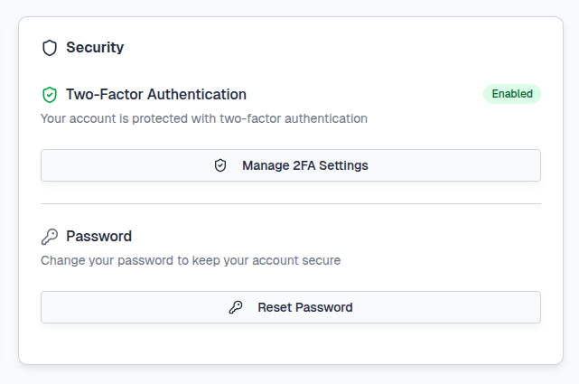

For more information on account authentication options and management see the [**Authentication page**](3.2.authentication.md).

---

## **Access to Support**

At the bottom left of the page you will find a button to **Open a support ticket**.

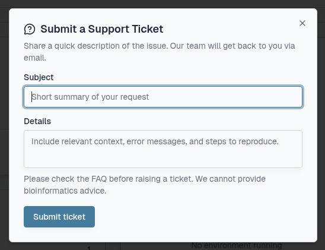

!!! tip
    When submitting a ticket, please provide as much information as possible with **reproducible examples/screenshots** if required.

All responses from our support team will be via email address.

---

## **404 error**

It is possible to be part of multiple CLIMB teams. If the last team you viewed on your bryn dashboard is disabled, you may receive a **404 Not Found error** as seen below. If this happens, please [**contact us**](mailto:climb@quadram.ac.uk).

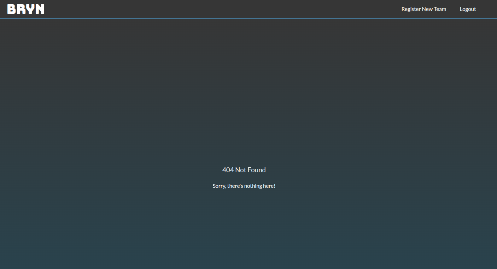