# **What are JupyterLab environments ?**

---

The **CLIMB JupyterLab environment** is a lightweight virtualised installation of Linux, capable of running complex data science and bioinformatics tasks. This environment utilises a next-generation user interface including a file browser, terminal, Jupyter notebooks, RStudio extension as well as Nextflow fully integrated with CLIMB and it's storage.

Thanks to the intelligent resource management technology developed by our team, the same system can accommodate users of all skill levels, from beginners to intermediates and experts.

This page will guide you through how to access JupyterLab environments with the following sections:

+ [**Advantages**](4.1.1.jupyterLab-envs.md#advantages)
+ [**Differences**](4.1.1.jupyterLab-envs.md#differences)
+ [**How to access JupyterLab environments ?**](4.1.1.jupyterLab-envs.md#how-to-access-jupyterlab-environments)
+ [**Resource allocation breakdown**](4.1.1.jupyterLab-envs.md#resource-allocation-breakdown)
+ [**Resource management**](4.1.1.jupyterLab-envs.md#resource-management)
+ [**403 error**](4.1.1.jupyterLab-envs.md#403-error)

---

## **Advantages**

Just as if you have your own physical machine, you'll have terminal access and a filesystem. Your home directory is persistent, even when your server is terminated, and you'll have out-of-the-box access to fantastic features like shared team storage, S3 buckets and more.

|   | Benefits                                             | Details                                                                                                                                                                       |
|---|------------------------------------------------------|-------------------------------------------------------------------------------------------------------------------------------------------------------------------------------|
|   | Accessible anywhere in the world  | Eliminates key loss and VM lockouts. Access JupyterLab environments through a user-friendly web interface, with time-limited sharing links for convenience.                                           |
|   | Flexible resource usage                              | Package-based access to minimum and maximum vCPUs and memory for JupyterLab environments. Upgrade for larger servers or use K8s for additional cluster resources. No need to reinstall. |
|   | GPU access                                           | Containers enable equitable GPU sharing, making them affordable compared to the VM model. CLIMB base image is pre-configured for easy A100 utilisation.              |
|   | Sandboxed environment for teaching and training      | Simplifies workshops: create a team, invite attendees, and share materials on team share or S3 storage. No SSH login hassles.                                                         |
|   | Pre-installed software and tools                     | CLIMB containers have pre-installed Conda, Nextflow, and CLI tools, ready to use, simplifying OS setup and team integration.                                           |

---

## **Differences**

The JupyterLab environment is a virtualised installation of Linux, and as such there are some differences to a standard Linux installation.

| Restriction                     | Solution                                                                                                                 |
|---------------------------------|--------------------------------------------------------------------------------------------------------------------------|
| No system wide superuser (sudo) | Install software with package managers (e.g. conda) rather than apt/yum.                             |
| No running of web services      | Static results (including HTML) can be hosted via S3.                                                                    |
| No support for opening ports    | This is out of scope for security reasons. |

---

## **How to access JupyterLab environments ?**

When you first login via [**bryn**](https://bryn.climb.ac.uk), you will automatically see the **JupyterLab Environment** dashboard.

In the centre of the page you will see the **JupyterLab Environment tile**: 


Here you can select **Launch** to create a JupyterLab environment:


Select a server profile, for example 'Standard server' or 'GPU server' (package dependent). With a standard server you will have access to our vCPUs while with a GPU server you will be given access to powerful NVIDIA A100 GPUs that enhance speed and performance.

Then select how many vCPUs: 2, 4 or 8.

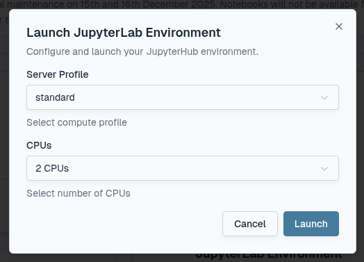

Select **Launch** and monitor the progress bar. The icon will turn green once it is ready.

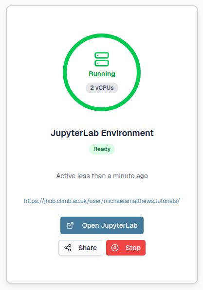

Either select the **URL** which looks like: https://jhub.climb.ac.uk/user/username.team/ or select the **Open JupyterLab** button:


This will automatically open a new tab with the **JupyterLab interface**.

On first login, you will be asked to authorize access to your bryn account. Select **Authorize**:

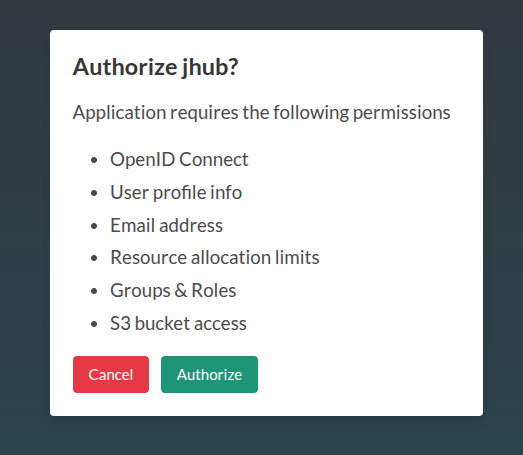

You should now have access to the JupyterLab interface.

!!! warning
    JupyterLab environments are transient and only **active for 96 hours** to release resource for other users when not in use. To keep JupyterLab environments running for longer you will need to open the URL again within the time limit. If you do not do this, any running processes will be killed however your data and environment settings will be preserved and available once you launch a new JupyterLab environment.

It is possible to share a JupyterLab environment with another user within your team for up to **24 hours** back within the bryn interface:


You will need to select the length of time the link is valid and confirm with the **Create Share Link** button:

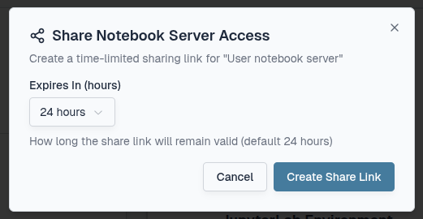

This will create a shareable link which you can copy and send to other users. If your JupyterLab environment is stopped, another user can launch their own instance independently. 

!!! Tip
    This feature should only be used for **troubleshooting** and instructional use to **enhance learning experiences** rather than practical work applications.

To stop your JupyterLab environment, back within the bryn interface you can select the **Stop** button:


You will need to confirm with the **Stop Server** button:

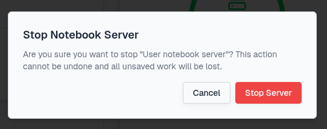

---

## **Resource allocation breakdown**

The number of JupyterLab environments available is dependant on your **quota** and **team size**. Individual users can launch one JupyterLab environment (2-8 vCPUs) each and multiple JupyterLab environments are possible within a team depending on the size selected.

!!! example
    If your team quota is 14 vCPUs, you could have three concurrent 4-vCPU JupyterLab environments or one 8-vCPU, one 4-vCPU and one 2-vCPU.

Any vCPUs not used for JupyterLab environments are reserved and available for **Nextflow tasks**. See our [**Nextflow page**](4.1.6.nextflow.md) for more information on using Nextflow within JupyterLab environments.

!!! info
    Our resources are designed to support your teams computational and storage needs effectively. Should your team require additional resources, see our [**Pricing page**](../../2.Pricing/index.md) and please [**contact us**](mailto:climb@quadram.ac.uk) for quota expansion options.

---

## **Resource management**

It is down to a team to manage it's vCPU usage amongst themselves.

Each time a JupyterLab environment is launched, a Kubernetes pod will be created. Pods are also used when launching Nextflow pipelines. A teams resources can be monitored in two ways:

1. Through the **Compute Usage section** on bryn
2. Through **kubectl** on the terminal

**Resource monitoring through bryn**

You can track which tasks are currently running through the **Compute Usage section** on the bryn dashboard. For more information on how to find the Compute Usage section, see the [**Bryn interface page**](../../3.Getting-started/3.3.bryn.md).

When no vCPUs are being utilised, bryn will show the following:

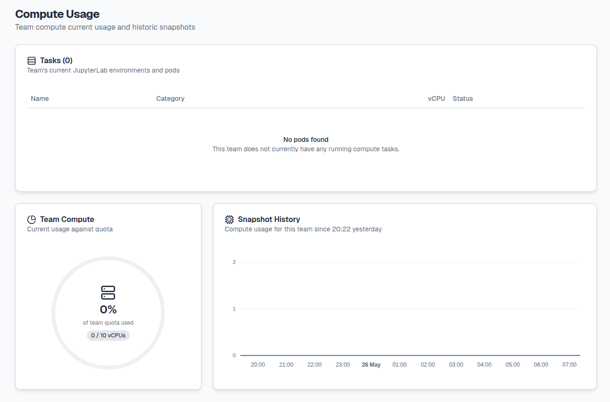

Once JupyterLab environments are launched they will appear as **jupyter-username-team** for each user with the JupyterLab Category and number of vCPUs utilised:

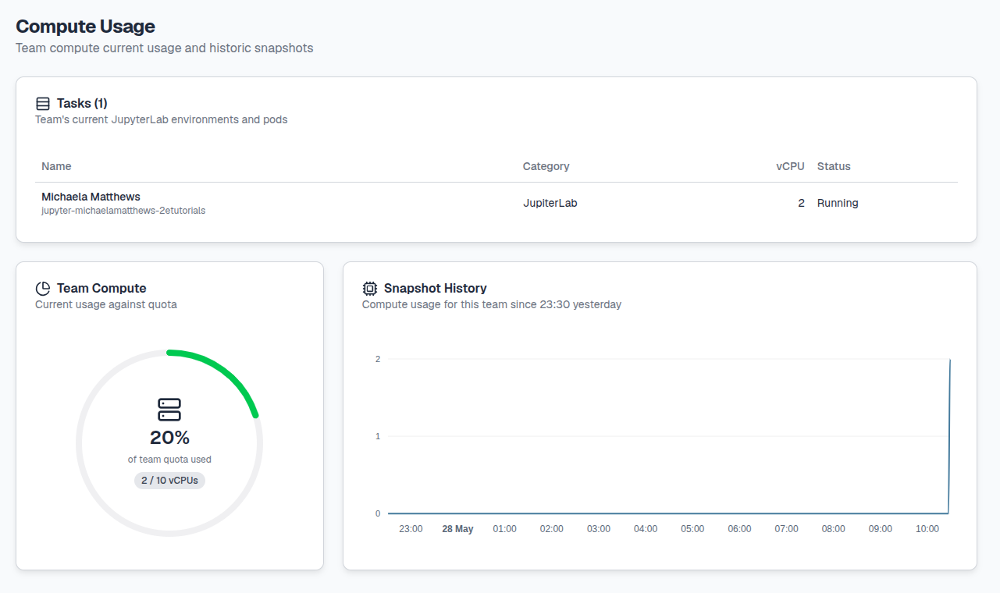

When Nextflow pipelines are run within your JupyterLab environments, the number of resulting tasks and vCPUs utlisied will also be shown with the Nextflow Category:

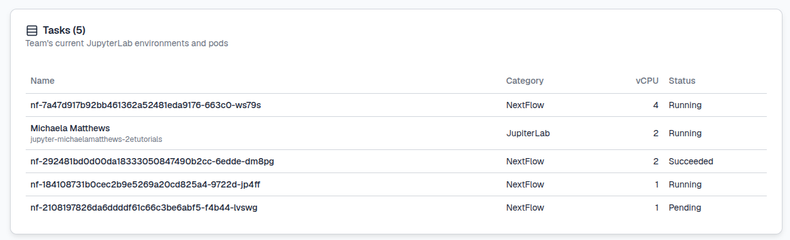

The **Status** of each of the pods will change as they execute and then disappear. For example each task above has a Running, Succeeded or Pending Status.

!!! warning
    This feature tracks all compute usage across your team. Once the resource quota has been reached, you will be unable to launch any further JupyterLab environments or run Nextflow tasks.

As more tasks are run, the Snapshot History will also update:

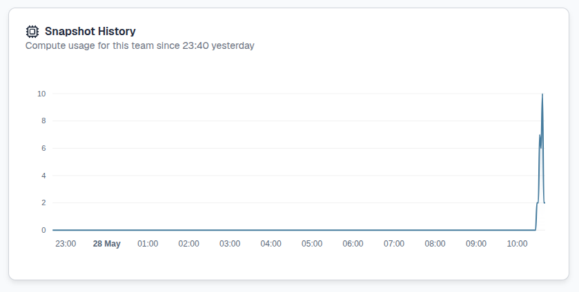

This feature is interactive, when hovering over the tile, you can view the vCPU usage specifically for a given time point. You can also scroll with your mouse or highlight a time period to see finer details in usage.

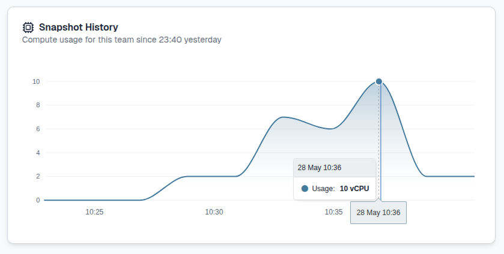

**Resource management through the terminal**

Once you have launched an environment you can also track which pods are running through [**`kubectl`**](https://kubernetes.io/docs/reference/kubectl/), the Kubernetes command line tool. It's pre-installed for you and pre-configured with credentials that map to your team. These credentials mean an isolated part of CLIMBs system is used specifically for your team. Just open a terminal tab and run the following command:

```
kubectl get pods
```

This will show you all running pods in your team and the pods status e.g:

```
NAME                                              READY   STATUS              RESTARTS   AGE
jupyter-michaelamatthews-2etutorials              1/1     Running             0          15m
nf-63705cdadc967d3910a373f132057dfe-2d739-sndcm   0/1     ContainerCreating   0          3s
nf-a922611d8a1da1a853e2c6ebabe06b2c-9848f-nw2dl   1/1     Running             0          2s
nf-3d1abbdf9d7a7b89572bc0b6b829b17b-67f06-qdjpb   1/1     Running             0          3s
nf-0a457946c393391076011a948ef8a69c-8637a-mc6rd   0/1     Completed           0          3s
nf-a5de6898341f2aa817341f647621bb72-14466-r8nhp   1/1     Running             0          2s
nf-db1493542ab262b56e4f10f75f6016cd-3c526-rxztj   0/1     Completed           0          3s
```

The **STATUS** of each of the pods will change as they execute and then disappear.

To delete specific pods you can use the following command:

```
kubectl delete pod <POD ID>
```

Please do be careful not to delete any pods running other team members servers (**jupyter-username-team**). However in the instance you do, the team member will see the following:

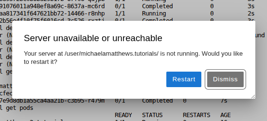

Select the **Restart** button and wait while JupyterLab relaunches the environment for you.

For more information on using nextflow pipelines, please see our [**Nextflow page**](4.1.6.nextflow.md).

---

## **403 error**

For users who are part of multiple CLIMB teams, this issue commonly arises during **transitions between teams** within bryn. For example, when users have a JupyterLab environment already open in one team and then switch to another team to open a new JupyterLab environment. This will create the following 403 error page:

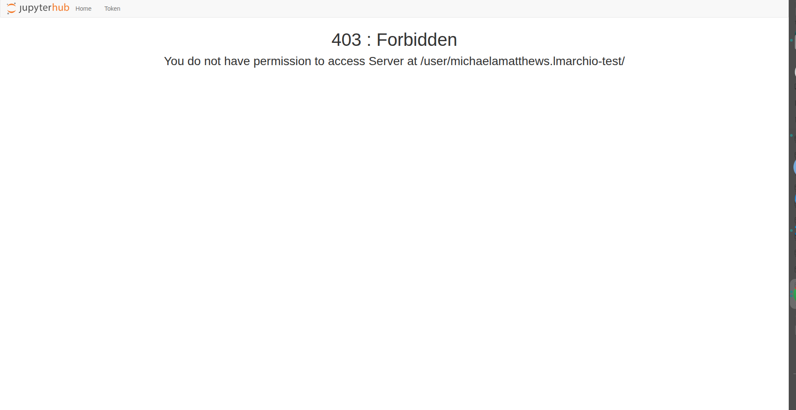

To overcome this issue select either **Home** or **Token** on the top left:


Next, select **Logout** on the top right:

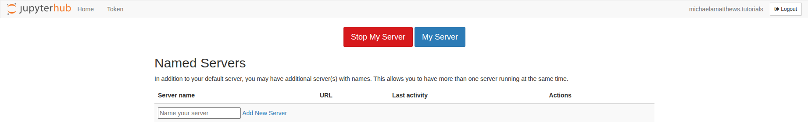

Once you have successfully logged out, select **Login** on the top right:

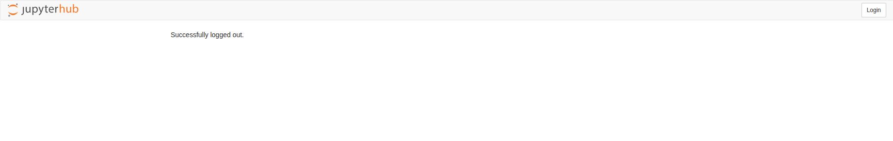

You will then be taken to the Bryn login page. Select **Authorize**:


You will then be able to access the JupyterLab environment through your current team.

---

# **What is next ?**

Once you have created a JupyterLab environment, you can explore the [**JupyterLab interface**](4.1.2.interface.md) and learn about how storage works on our [**Storage page**](../4.2.Storage/index.md) to begin your research.