# **What can I do with a JupyterLab environment ?**

---

When you first open the JupyterLab environment, you'll be presented with a [**JupyterLab**](https://jupyterlab.readthedocs.io/en/latest/) interface. This is a web-based interface that allows you to interact with the JupyterLab environment.

This page will guide you through how to navigate the JupyterLab environment and its features with the following sections:

+ [**JupyterLab terminology**](4.1.2.interface.md#jupyterlab-terminology)
+ [**The JupyterLab interface**](4.1.2.interface.md#the-jupyterlab-interface)
+ [**Using the interface**](4.1.2.interface.md#using-the-interface)

If you are unsure how to get to this interface, please see the [**JupyterLab page**](4.1.1.jupyterLab-envs.md).

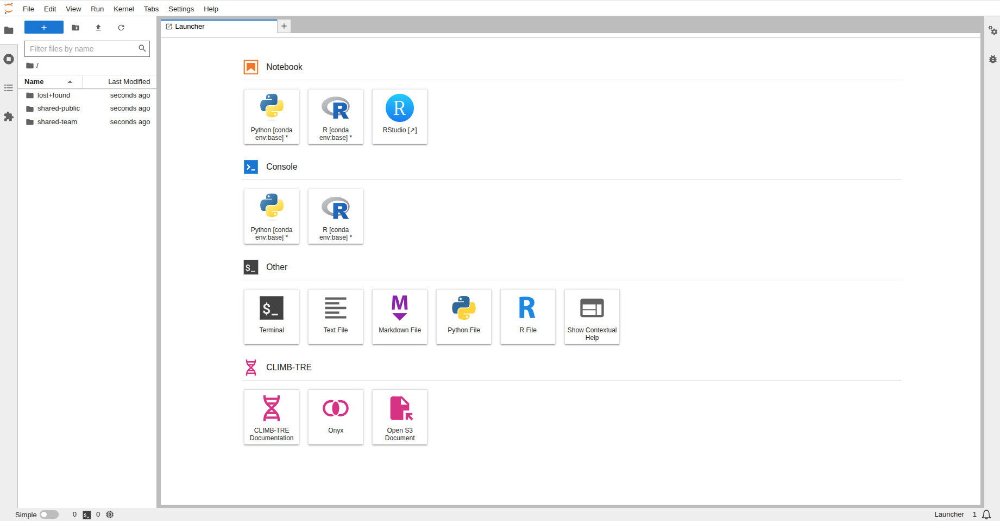

---

## **JupyterLab terminology**

To avoid confusion, here are a few similar but different terms that we use throughout the CLIMB documentation:

+ **JupyterLab** - the next-generation user interface including a file browser, a terminal, an RStudio extension, as well as Jupyter Notebooks and Nextflow access.
+ **Jupyter Notebook** - a powerful and popular tool **within the interface** for interactive computing, data analysis, and data visualisation.

We highly recommend spending a few moments familiarising yourself with the basic JupyterLab interface. Follow the steps below and head to the [**JupyterLab interface docs**](https://jupyterlab.readthedocs.io/en/stable/user/interface.html) for more detailed information on using the interface.

Before we start there are a few terms which you might not be familiar with;

+ **Console:** run code interactively in a kernel.

+ **Kernel:** separate processes which run different coding languages and environments.

+ **Notebooks:** Jupyter notebooks (.ipynb files) which can be run with different coding languages through kernels.

---

## **The JupyterLab interface**

The JupyterLab interface consists of 3 main components; the menu bar, sidebar and main work area.

1. **Menu bar:** where you can select interface actions (File, Edit, View, Run etc.).

2. **Sidebar:** where you can access the file browser.

3. **Main work area:** where you can place all your open tabs and arrange them as you like.

An overview of what you can do in each component will be explained below:

---

## **Menu bar**

Here you can select different actions relating to different aspects of the interface:

+ **File:** Actions for files and folders

+ **Edit:** Actions for editing documents

+ **View:** Actions to change the appearance of JupyterLab

+ **Run:** Actions for code within notebooks and consoles

+ **Kernel:** Actions for managing kernels

+ **Tabs:** List of open documents and activities

+ **Settings:** Common and advanced settings management

+ **Help:** A list of helpful links

---

## **Sidebar**

Here you can easily access and navigate the **file system** to create, upload, download and manage files and directories.

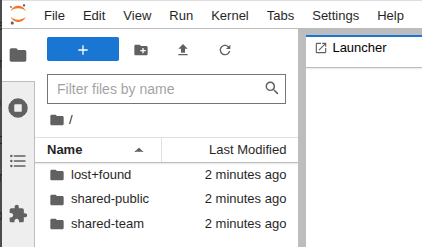

Your **home directory** `/home/jovyan (~)` serves as the default/base location for the file browser. You will automatically have the following directories mounted to  your home directory:

+ lost+found
+ shared-public
+ shared-team

For more detailed information on CLIMBs storage options see our [**Storage page**](../4.2.Storage/index.md).

!!! warning
    Please be aware that your home directory is not a safe place for storage, you should use the `shared-team` directory or S3 buckets for your data and databases. If your home directory is full, **you will not be able to launch new JupyterLab environments**.

---

## **Main work area**

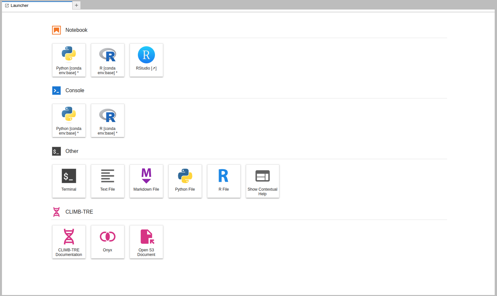

Within the main work area you can start different analysis through the **launcher**. Clicking on one of these tiles will open a new tab in the activity area. Each new activity starts a new kernel, a separate processes which allows you to use different programming languages/features as a new tab. 

The Main Work Area launcher is separated into 4 sections; Notebook, Console, Other and CLIMB-TRE. Each section contains shortcuts to launch different applications:

### **Notebook**

This section includes shortcuts to launch **Jupyter notebooks** using both python and R kernels. It also allows users to launch the **RStudio** extension.

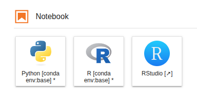

For more information on using Jupyter notebooks, see our [**Jupyter Notebooks page**](4.1.4.jupyter-notebook.md).

For more information on using R and RStudio, see our [**RStudio page**](4.1.5.rstudio.md).

### **Console**

This section includes shortcuts to launch code (python, R) interactively in a kernel.

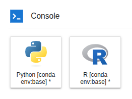

### **Other** 

This section includes shortcuts to create a new terminal session, new files (text, markdown, python, R) and access contextual help.

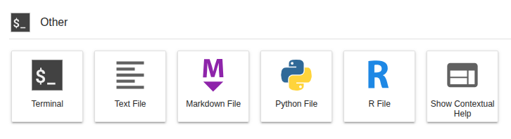

For more information on using the terminal, see our [**Terminal page**](4.1.3.terminal.md).

For more information on using Nextflow via the terminal, see our [**Nextflow page**](4.1.6.nextflow.md).

!!! info
    Please note that when you install a new environment via **conda**, it will **appear as new tiles** in the Notebook and Console sections.

### **CLIMB-TRE**

The CLIMB Trusted Research Environment (CLIMB-TRE) is a package specific project.

This sections includes shortcuts for specific use cases and **is not relevant for the majority of users**. This includes CLIMB-TRE documentation, Onyx access and S3 documents.

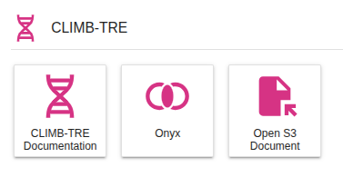

---

## **Using the interface**

You can have multiple tabs open in the activity area:

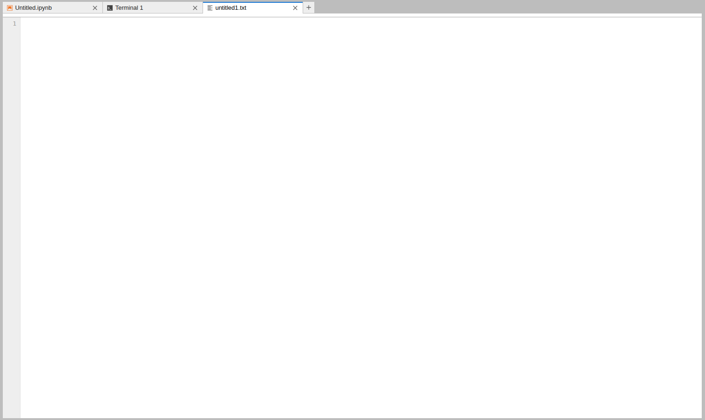

You can drag and drop tabs in the activity area to rearrange them: 

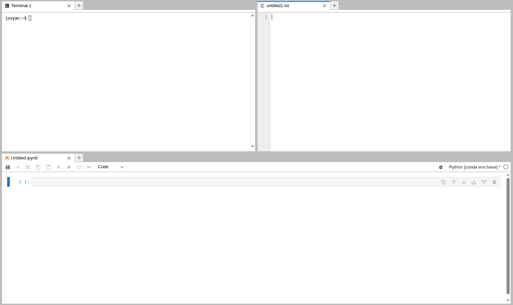

You can also drag and drop files from the file browser into the activity area to open them in the appropriate application. 

Tabs can be resized or subdivided, just drag a tab to the center of a tab panel to move the tab to the panel. Subdivide a tab panel by dragging a tab to the left, right, top, or bottom of the panel.

To create a new tab, click the `+` icon in the top right of the activity area, or use `File > New Launcher`. Ctrl+Shift+L

!!! tip
    With everything accessible in one place, there is no need for a single user to have access to multiple JupyterLab environments from Bryn. You can have all your work running in tandem in one JupyterLab environment.

---

### **Manage kernels and terminals**

When you close a notebook or terminal from the main work area, it will still continue to run. To manage them you can use the **sidebar**.

You can close running kernels or terminals individually or use the **Shut Down All** button:

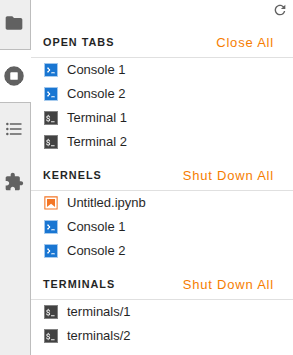

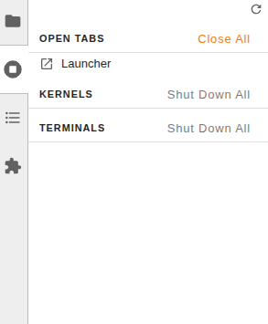

---

# **What is next ?**

Once you are familiar with the JupyterLab interface, have a look at how storage is integrated with the interface on our [**Storage page**](../4.2.Storage/index.md).

You can also have a look at our documentation dedicated to using the [**terminal**](4.1.3.terminal.md), [**Jupyter notebooks**](4.1.4.jupyter-notebook.md), [**RStudio**](4.1.5.rstudio.md) and [**Nextflow**](4.1.6.nextflow.md).