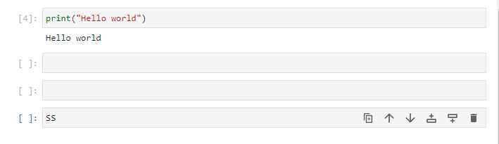
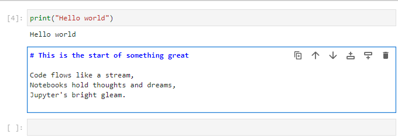
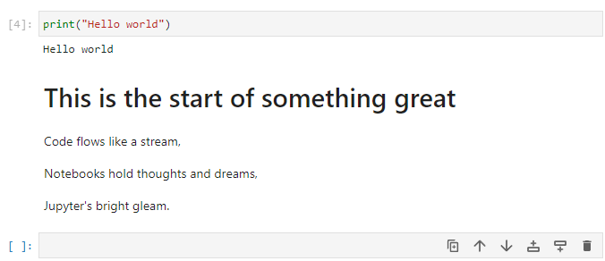

# **What is a Jupyter notebook ?**

---

You've heard of our JupyterLab environments, the virtual Linux container hosting JupyterLab but within the interface are **Jupyter notebooks**, a powerful and popular tool for interactive computing, data analysis, and data visualisation. They allow you to create and share documents that contain live code, equations, visualisations, and explanatory text, making them an excellent choice for data scientists, researchers, and educators.

You can find more detailed information in the dedicated [**Jupyter Notebook docs**](https://jupyter-notebook.readthedocs.io/en/latest/).

This page will guide you through the basics of jupyter notebooks with the following sections:

+ [**Advantages of Jupyter notebooks**](4.1.4.jupyter-notebook.md#advantages-of-jupyter-notebooks)
+ [**How can I launch a Jupyter Notebook ?**](4.1.4.jupyter-notebook.md#how-can-i-launch-a-jupyter-notebook)
+ [**Installing Python packages in Jupyter Notebooks**](4.1.4.jupyter-notebook.md#installing-python-packages-in-jupyter-notebooks)

---

## **Advantages of Jupyter notebooks**

* **Interactive Computing**: Jupyter Notebooks provide an interactive computing environment. Users can run code cells individually, making it easy to experiment, iterate, and visualize data in real-time.
* **Data Visualisation**: Jupyter Notebooks support rich data visualization libraries like Matplotlib, Seaborn, and Plotly. This allows users to create interactive plots, charts, and graphs directly within the notebook.
* **In-line Markdown**: Notebooks support Markdown cells, allowing users to document their code and analyses with formatted text, images, links, and even equations using LaTeX syntax.
* **Shareability and Reproducibility**: Notebooks can be easily shared with others, facilitating collaboration and reproducibility. By sharing the code and output together, others can reproduce the same results and understand the analysis.
* **Code Modularity**: Notebooks allow breaking down complex analyses into smaller, more manageable code cells. This modularity makes the code easier to read, test, and maintain.
* **Kernel Support**: Jupyter Notebooks support multiple kernels, enabling users to work with different programming languages (Python, R, etc.) in the same environment.

---

## **How can I launch a Jupyter Notebook ?**

You can launch a Jupyter notebook from the Notebook launcher within the main work area. Jupyter notebooks (.ipynb files) can be run with different coding languages through kernels. Just select the which kernel (e.g Python/R) you would prefer:

The Jupyter Notebook interface consists of two main components:

1. Settings bar
2. Code cells

You primarily interact with the notebook by writing and running *Code cells*. Code cells in Jupyter Notebooks are the areas where you can write, execute, and interact with live code. They are one of the fundamental building blocks of Jupyter Notebooks and are used to perform computations, run algorithms, manipulate data, and create visualizations. When you run a code cell, the code inside it is executed by the kernel associated with the notebook (e.g., IPython for Python code).

To run a code cell, select it and either press the "Run" button in the toolbar or use the keyboard shortcut "Shift + Enter". The code will be executed, and the output (if any) will be displayed below the cell. Try this now with a simple "hello world" example.

In the grey box. Type `print("Hello world")` and press `Shift + Enter`. You should see the output below the cell. By pressing the plus button in the tool bar, you can add a new cell below the current one. Try this now.

You can also change the type of a cell from the toolbar. Try changing the type of the new cell to "Markdown" and typing some text (see the dropdown in the toolbar). Then run the cell to see the formatted text.

!!! tip
    Markdown cells are used to add explanatory text, headings, images, links, and more to your notebook. You can use Markdown syntax to format the text. To render the formatted text, run the markdown cell.

### **Saving and exporting your work**

To save your notebook, use either the "Save" option from the menu bar or press "Ctrl + S" or "Cmd + S" (on Mac) keyboard shortcuts. To export your notebook in various formats (e.g., HTML, PDF, Python script), go to "File" -> "Save and Export Notebook As..." in the menu bar and select the desired format.

### **Markdown formatting**

These are just some of the basic Markdown syntax elements you can use to format text. Markdown allows you to easily create headings, emphasize text, create links, add images, create lists, quote text, and even include code blocks for different programming languages.

| Markdown Syntax         | Output                          |
|------------------------|---------------------------------|
| `# Heading 1`          | # Heading 1                     |
| `## Heading 2`         | ## Heading 2                    |
| `### Heading 3`        | ### Heading 3                   |
| `**Bold Text**`        | **Bold Text**                   |
| `*Italic Text*`        | *Italic Text*                   |
| `~~Strikethrough~~`    | ~~Strikethrough~~               |
| `[Link](https://climb.ac.uk/)` | [Link](https://climb.ac.uk/) |
| ``   |     |
| `1. Item 1`            | 1. Item 1                       |
| `2. Item 2`            | 2. Item 2                       |
| `- Unordered List`     | - Unordered List                |
| `> Blockquote`         | > Blockquote                    |

### **Additional Tips and Tricks**

* You can reorder cells by clicking and dragging them to a new position.
* To delete a cell, select it and use the "Edit" -> "Delete Cells" option or press "Ctrl + Shift + Backspace."
* To change the type of a cell, use the dropdown menu in the toolbar and select either "Code" or "Markdown."
* Jupyter Notebooks support auto-completion, which can be triggered by pressing "Tab" while typing code.
* To get help on a function or object, append a question mark (?) at the end and run the cell.

### **Manage kernels**

When you close a notebook from the main work area, it will still continue to run. To manage them you can use the **sidebar**.

You can close running kernels individually or use the **Shut Down All** button:

---

## **Installing Python packages in Jupyter Notebooks**

Conda is the recommended way to install software on your Jupyter Notebook Servers].
If you have Python packages software in a Conda environment, you can make them available by installing `ipykernel` in that Conda environment.  To switch to the kernel associated with that environment, click on the current kernel near the top-right of the notebook (usually "Python [conda env:root]" or "Python 3 (ipykernel)") and selecting the kernel from the options under **Start Preferred Kernel**.  e.g., "Python [condaenv:bactopia]".

### Using the Python notebook with custom libraries

1. Open a terminal tab.
2. Create a new environment with the requested libraries plus `ipykernel`, using `conda create -n EnvName ... ipykernel`. Suppose you want to create an environment called `dataexplorer` with Pandas, Seaborn, and Matplotlib, you would use `conda create -n dataexplorer pandas seaborn matplotlib ipykernel`.
3. Open the launcher, and you will see a new icon with the environment name under the Python Icon. Click on it to create a new notebook with the new environment.
4. From that notebook you will be able to `import pandas as pd`, for example.

---

# **What is next ?**

Once you know some jupyter notebook basics, you can also try using the [**Terminal**](4.1.3.terminal.md), [**RStudio**](4.1.5.rstudio.md) and [**Nextflow**](4.1.6.nextflow.md).