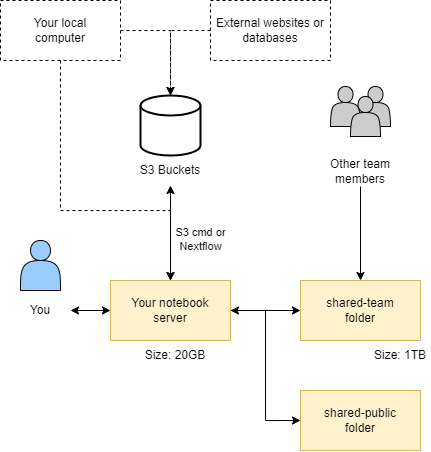

# **What storage is available ?**

---

Data in CLIMB can be found in four major locations:

+ [**Home directory:**](4.2.1.storage.md#home-directory) 20GB of storage with write access for a single user.

+ [**Team share:**](4.2.1.storage.md#team-share-shared-team) 1TB+ storage with read and write access for a whole team.

+ [**S3 buckets:**](4.2.1.storage.md#s3-buckets) 1TB+ storage for long term data storage.

+ [**Public share:**](4.2.1.storage.md#public-shared-shared-public) read access only storage for pre installed databases.

These data locations interact with each other as shown in the diagram below:

---

## **Home directory**

Your home directory `/home/jovyan` (`~`) is mounted to persistent storage, ensuring data retention after a JupyterLab environment restarts. It serves as the default/base location for the file browser. Your home directory is intentionally a **small size (20GB)** which makes it unsuitable for large conda environments or databases. Alternative storage options are available for such purposes.

!!! info
    Your username is `jovyan` by default (there's a backstory, but it means 'related to Jupyter'). Your JupyterLab environment is running as a [container](https://cloud.google.com/learn/what-are-containers). The container instance is private and linked to your Bryn user's storage, but the image it runs is the same for everyone. As a result, it is not necessary or desirable to have unique system users.

    **TLDR:** don't worry about it. Inside your JupyterLab environment, your username will always be `jovyan`.

---

## **Team share (shared-team)**

A writeable **team share** is accessible at `/shared/team`, symlinked to your home directory as `shared-team` for easy file browsing. It offers significant storage space (1TB+ depending on research package/quota) and grants all team members simultaneous **read and write access**. Additionally, it benefits from SSD-backed technology, ensuring exceptionally fast performance.

!!! warning
    Team share Storage is primarily intended for **temporary data storage**. While it offers convenience and accessibility for collaborative projects, it's important to avoid extended storage durations due to it's limited capacity. For long-term data storage and enhanced data safety, consider utilising S3 buckets.

---

## **S3 Buckets**

S3 (Simple Storage Service) buckets are **cloud storage containers** provided by Amazon Web Services (AWS). 

Instead of organising data into folders and files like on a computer, it treats each piece of data as a separate "object" with a unique name. Object storage is highly scalable, meaning it can handle a huge amount of data without slowing down. It also keeps copies of data securely to make sure it doesn't get lost. 

This creates a scalable and cost-effective solution for storing various types of data, such as files, images, videos, backups, and application data. S3 buckets are highly durable and accessible over the internet, making them a popular choice for hosting static websites, data archiving, and serving as the backend for various cloud applications.

We recommend S3 buckets for long term storage of data and pulling them down on demand for analysis. For more information on using S3 buckets see our [**S3 buckets page**](4.2.2.s3-buckets.md).

!!! info
    Our resources are designed to support your teams computational and storage needs effectively. Should your team require additional resources, see our [**Pricing page**](../../2.Pricing/index.md) and please [**contact us**](mailto:climb@quadram.ac.uk) for quota expansion options.

---

##  **Public shared (shared-public)**

In addition to the team share, you may also notice additional mounts under `/shared/`, including `/shared/public`. Here you will find **read-only data and resources** provided by CLIMB, that may be useful to microbial bioinformatics workflows. 

---

## **Team storage management**

You can track your teams storage usage via the bryn dashboard. 

See our [**Bryn page**](../../3.Getting-started/3.3.bryn.md) for more information.

---

# **What is next ?**

Once you understand the storage on offer, you can look at our [**S3 Bucket page**](4.2.2.s3-buckets.md).