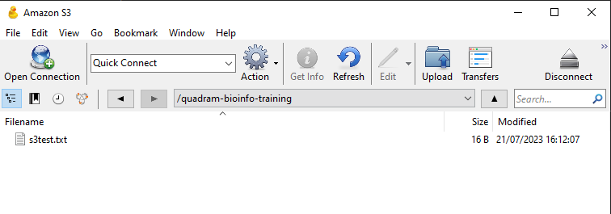
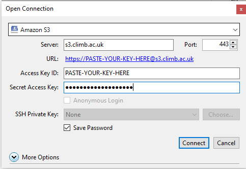
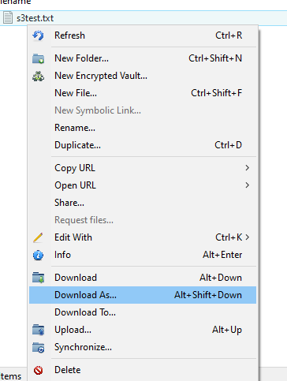

# **How to use S3 Buckets ?**

---

Data can easily be transferred **from your local machine into S3 buckets**.

For more information on what S3 buckets are and how to set up them up, see our [**S3 Buckets page**](4.2.2.s3-buckets.md).

This page will guide you through how to transfer data into S3 buckets with the following sections:

+ [**File transfer using the Bryn interface**](4.2.3.data-transfer-local.md#file-transfer-using-the-bryn-interface)
+ [**S3 configuration**](4.2.3.data-transfer-local.md#s3-configuration)
+ [**File transfer using a file transfer client**](4.2.3.data-transfer-local.md#file-transfer-using-a-file-transfer-client)
+ [**File transfer using the command line**](4.2.3.data-transfer-local.md#file-transfer-using-the-command-line)

---

## **File transfer using the Bryn interface**

From the Bryn S3 interface, select the bucket you wish to upload data to.

To upload a file, either select the **File button** on the top or select the **Upload icon** underneath. Here you can type or Browse which Bucket to upload to. You can drag and drop files.


!!! tip
    For larger files, you can transfer files programmatically as seen in the following sections below.

---

## **S3 configuration**

To programmatically transferring data to and from buckets, you will need some configuration to be able to access your CLIMB S3 buckets. For this you require your S3 credentials. Credentials include your S3 username, Access Key ID and Secret Access Key which you can find under the **Credentials tab**.

See our [**S3 Buckets page**](4.2.2.s3-buckets.md#s3-credentials) for more information on where to find your S3 credentials.

---

## **File transfer using a file transfer client**

You can use file transfer client software to transfer files to the S3 buckets. **This will require your S3 credentials**.

To demonstrate how to transfer files using a file transfer client, we will use [**Cyberduck**](https://cyberduck.io/). This is available for Windows and MacOSX. You can [**Download and install the software**](https://cyberduck.io/download/) and then open it. You will be presented with a window like this:



Click on the **Open Connection** button, and then select **Amazon S3** from the dropdown menu. You will then be presented with a window like this:



Enter the following details:

* **Server**: s3.climb.ac.uk
* **Access Key**: Your access key from Bryn
* **Secret Access Key**: Your secret access key from Bryn

Then click **Connect**. You will be presented with a window of all your teams buckets, mirroring what is visible in Bryn. Double click on the bucket you want to upload to, and you will see the contents of the bucket.

You can upload to the bucket using the upload button in the **top left** of the window. You can also drag and drop files and folders into the window to upload them.

You can right click on files and folders to download them.



For more information about Cyberduck, see [**here**](https://docs.cyberduck.io/cyberduck/).

---

## **File transfer using the command line**

You can also use the command line to transfer files from your local machine to S3 buckets. **This will require your S3 credentials**.

To demonstrate how to transfer files using the command line, we will use [**`s3cmd`**](http://s3tools.org). You can install the software using pip:

```
pip install s3cmd -U
```

You will need to configure s3cmd with your S3 credentials:

```
s3cmd --configure
```

It will then ask a series of questions. The answers are:

* **Access Key:** Your access key from Bryn
* **Secret Key:** Your secret access key from Bryn
* **S3 Endpoint:** s3.climb.ac.uk
* **DNS-style bucket+hostname:port template for accessing a bucket:** %(bucket)s.s3.climb.ac.uk

For all other options just use the default values, listed in the square brackets [ ]. You can just press **enter** to accept the default values.

If we use `s3cmd` to list the buckets, you will be presented with a list of all your teams buckets, mirroring what is visible in Bryn:

```
s3cmd ls
```

### **Basic s3cmd commands:**

The most common s3cmd commands can be seen below:

To **create** a new bucket use the `mb` command:

```
s3cmd mb s3://group-name
```

To **remove** bucket use the `rb` command:

```
s3cmd rb s3://group-name
```

To **list** objects or buckets use the `ls` command:

```
s3cmd ls [s3://group-name[/PREFIX]]
```

To **list** all object in all buckets use the `la` command:

```
s3cmd la
```

To **add** a file into bucket use the `put` command:
 
```
s3cmd put FILE [FILE...] s3://group-name[/PREFIX]
```

To **retrieve** a file from a bucket use the `get` command:

```
s3cmd get s3://group-name/OBJECT LOCAL_FILE
```
  
To **delete** a file from a bucket use the `del` or `rm` command:

```
s3cmd del s3://group-name/OBJECT
s3cmd rm s3://group-name/OBJECT
```
 
To **copy** an object use the `cp` command:

```
s3cmd cp s3://group-name1/OBJECT1 s3://group-name2[/OBJECT2]
```

To **move** an object use the `mv` command:

```
s3cmd mv s3://group-name1/OBJECT1 s3://group-name2[/OBJECT2]
```