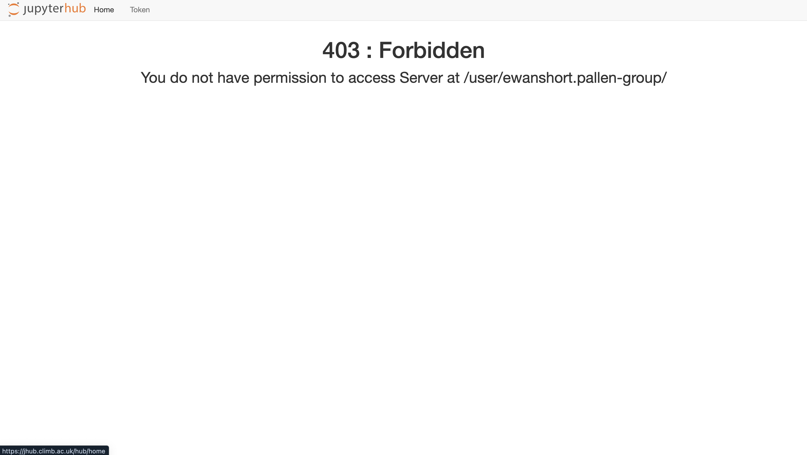
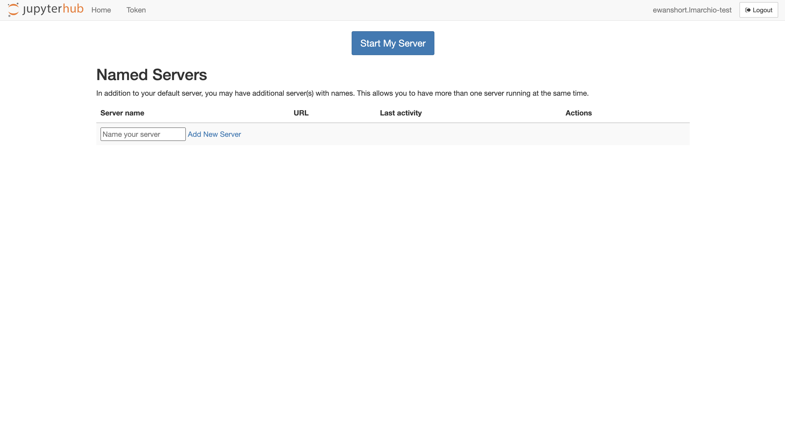
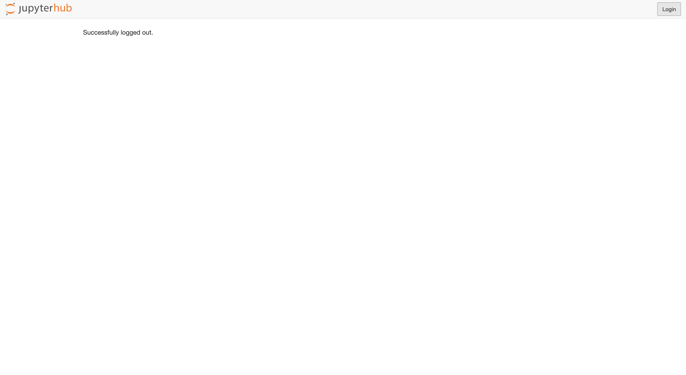
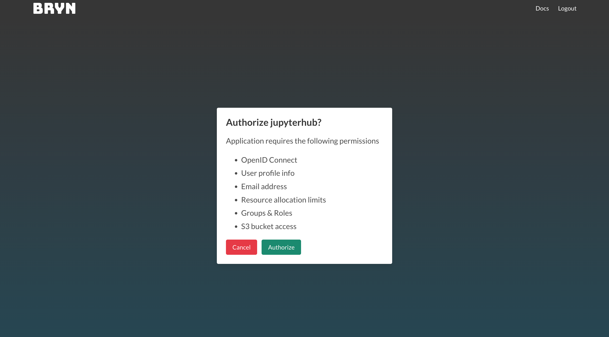

# 403 Forbidden Error

This issue commonly arises during transitions between teams within BRYN, especially when users are managing multiple tasks across various teams. It typically occurs when users have a notebook already open in one team and then proceed to switch to another team, attempting to open a new notebook.

Addressing this issue is straightforward with the following steps:

1.) Click either 'Home' or 'Token':

2.) Click 'Logout':

3.) Once you have successfully logged out, click 'Login':

4.) You will then be taken to the BRYN login page. Click 'Authorize':

5.) You will then be able to access the notebook.

