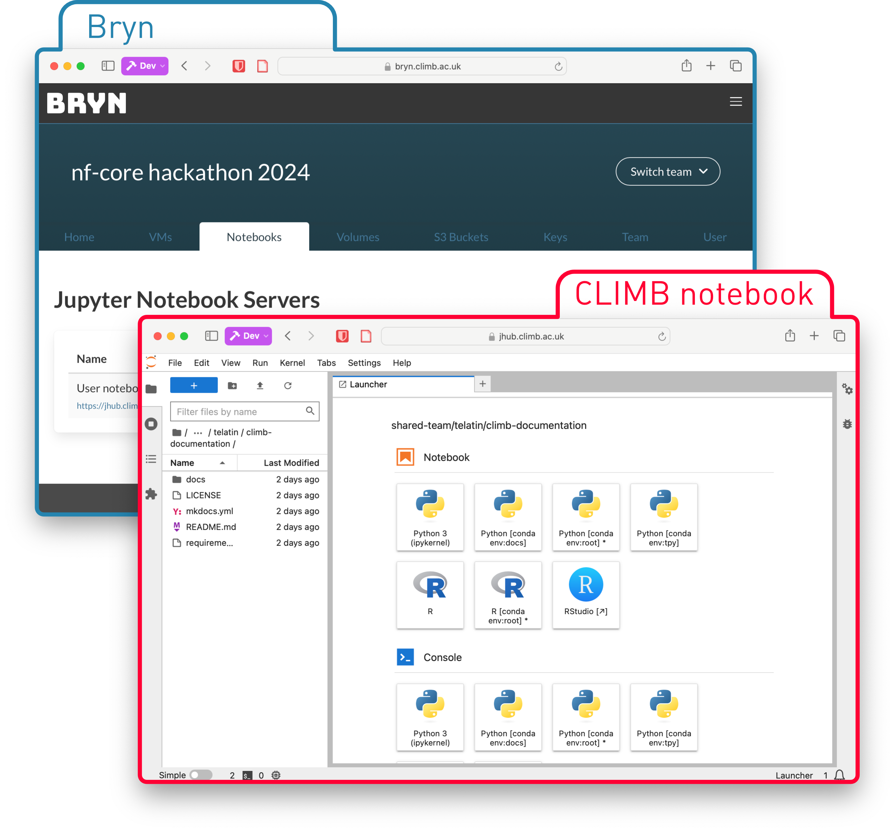

# Overview

{ width=250 style="background-color: black;" }

Welcome to the [CLIMB-BIG-DATA](https://climb.ac.uk/) documentation!

These docs are designed to help you get the best out of the CLIMB-BIG-DATA infrastructure.

## Getting started

How to access CLIMB-BIG-DATA and find your way around via the **Bryn** web interface.
[Bryn](https://bryn.climb.ac.uk) is the web interface for CLIMB-BIG-DATA, and is the primary way to access the infrastructure.
From Bryn  you can manage your team, its resources, the S3 buckets and your notebooks. **CLIMB Notebooks**, on the other hand,
are Jupyter notebooks fully integrated with CLIMB and its storage, with first-class support to Nextflow pipelines.

{ width=600 style="background-color: white; margin: auto;" }

[Registration](getting-started/how-to-register.md)  
How to register and access CLIMB-BIG-DATA.

[Authentication](getting-started/authentication.md)  
How to login to Bryn, and setup two-factor authentication.

## Notebook Servers

Everything you need to understand, use and get the most out of Jupyter Notebook Servers.

[Introduction](notebook-servers/read-this-first.md)  
An introduction to the what and why of notebook servers.

[Quick start](notebook-servers/quick-start.md)  
How to launch, access and get started using a notebook server.

[Using the terminal](notebook-servers/using-the-terminal.md)  
How to use the terminal inside a notebook server, with an explanation of caveats.

[Using Visual Studio Code](notebook-servers/using-vscode.md)  
How to connect to your CLIMB Notebook using VS Code

[Understanding storage](storage/index.md)  
An explanation of the different storage options available and when to use what.

[Installing software with Conda](notebook-servers/installing-software-with-conda.md)  
How to install software using Conda, in the context of a containerized environment.

[Using Nextflow](notebook-servers/using-nextflow.md)  
How to use Nextflow with CLIMB-BIG-DATA.

[Metagenomics walkthrough](walkthroughs/metagenomics-tutorial.md)  
A simple walk-through of some CLIMB-BIG-DATA functionality.

[QIIME 2](walkthroughs/qiime2.md)  
How to install QIIME 2 on a notebook server and basic usage.

[nf-core pipelines](walkthroughs/nfcore.md)  
How to run some of the nf-core pipelines on CLIMB notebooks

[How to fix login error 403](notebook-servers/403-forbidden-error.md)  
An explanation of how to resolve login error 403 when accessing notebooks.

