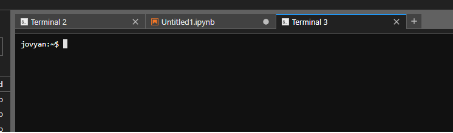

# About Notebook Servers

Welcome to CLIMB's Jupyter Notebook Servers, your new home on CLIMB-BIG-DATA.
A Notebook Server is a lightweight virtualised installation of Linux
that users interact with through [JupyterLab](https://jupyterlab.readthedocs.io/),
which grants access to various applications (e.g. 
[terminals](using-the-terminal.md),
[Jupyter notebooks](using-jupyter.md),
[RStudio](using-jupyter.md),
[Nextflow](using-nextflow.md))
and enables users to run complex data science and bioinformatics tasks.
The possibilities are demonstrated in the walkthroughs in the sidebar.

## Advantages of the Notebook Server

Just as if you have your own physical machine, you'll have terminal access and a filesystem. Your home directory is persistent, even when your server is terminated, and you'll have out-of-the-box access to fantastic features like a shared team volume, S3 buckets and more.

|   | Benefits                                             | Details                                                                                                                                                                       |
|---|------------------------------------------------------|-------------------------------------------------------------------------------------------------------------------------------------------------------------------------------|
|   | Accessible anywhere in the world  | Eliminates key loss and VM lockouts. Access notebook servers through a user-friendly web interface, with time-limited sharing links for convenience.                                           |
|   | Flexible resource usage                              | Tier-based access to minimum and maximum vCPUs and memory for notebook servers. Upgrade for larger servers or use K8s for additional cluster resources. No need to reinstall. |
|   | GPU access                                           | Containers enable equitable GPU sharing, making them affordable compared to the VM model. CLIMB-BIG-DATA base image is pre-configured for easy A100 utilization.              |
|   | Sandboxed environment for teaching and training      | Simplifies workshops: create a team, invite attendees, and share materials on team drive or S3. No SSH login hassles.                                                         |
|   | Pre-installed software and tools                     | CLIMB-BIG-DATA container has pre-installed Conda, Nextflow, and CLI tools, ready to use, simplifying OS setup and team integration.                                           |

## Key differences to standard Linux installation

The notebook server is a virtualised installation of Linux, and as such there are some differences to a standard Linux installation.

| Restriction                     | Solution                                                                                                                 |
|---------------------------------|--------------------------------------------------------------------------------------------------------------------------|
| No system wide superuser (sudo) | Install software within home directory with package managers (e.g. conda) rather than apt/yum                             |
| No running of web services      | Static results (including HTML) can be hosted via S3.                                                                    |
| No support for opening ports    | This is out of scope for notebooks, but CLIMB-BIG-DATA does have short term leases for more traditional virtual machines |

## How to launch and access a notebook server

1. [Log in to Bryn](../getting-started/authentication.md).
2. Using the navigation menu on the left hand side, select 'Notebook servers' under the 'Compute' subheading.
3. Click the 'Launch notebook server' green action button on the right hand side.
4. Select a profile, for example 'Standard server' or 'GPU server' (tier dependent).
5. Click 'Launch Server' and monitor the progress bar.
6. Once ready, click the URL beneath the 'User notebook server'.
7. On first login, you may be asked to authorize access to your Bryn account. Click 'Authorize'.
8. The JupyterLab interactive computing interface should open in a new tab.

## Acclimatise yourself to the Notebook Server

When you first open the notebook server, you'll be presented with a JupyterLab interface. This is a web-based interface that allows you to interact with the notebook server.


The JupyterLab interface is divided into a few areas. You'll see context menus at the top (File, Edit, View, Run etc.), a file browser pane on the left, and an activity area that initially displays a launcher interface with tiles. Clicking on one of these tiles will open a new tab in the activity area.

These tiles are shortcuts to launch different applications. The most common one is the `Terminal`, which will open a terminal in the activity area. You can also launch a Jupyter Notebook, RStudio, or a text editor.

You can have multiple tabs open in the activity area, and you can drag and drop them to rearrange them. You can also drag and drop files from the file browser into the activity area to open them in the appropriate application. To create a new tab, click the `+` icon in the top right of the activity area, or use `File > New Launcher`.



For this reason, there is no option to launch multiple notebook servers from Bryn. You should be able to have all your work running in tandem in one notebook server.

## Is this just for beginners?

Absolutely not. Whilst the new service is certainly far easier to get started with, it is also far more powerful for advanced users. We've ensured that each team gets a pre-mounted Kubernetes service user with permissions scoped to your team's namespace. This allows users to run Nextflow workflows on the external K8s execution environment, but also to run other containers in pods within their namespace via `kubectl`.

## Organising your data storage

The notebook server has a few different storage locations available to you. We can explore those via the `terminal`.


From the terminal, you can see your home directory, which is where you'll be by default when you open the terminal. You can list the contents of your home directory by typing `ls` (or `ls -l` for a detailed listing):

```
jovyan:~$ cd ~/
jovyan:~$ ls -l
total 12
drwxr-sr-x 3 jovyan users 4096 Jul 19 17:02 R
lrwxrwxrwx 1 jovyan users   14 Jul 19 18:23 shared-public -> /shared/public
lrwxrwxrwx 1 jovyan users   12 Jul 19 18:23 shared-team -> /shared/team
-rw-r--r-- 1 jovyan users  617 Jul 20 10:53 Untitled1.ipynb
-rw-r--r-- 1 jovyan users   72 Jul 19 18:22 Untitled.ipynb
-rw-r--r-- 1 jovyan users    0 Jul 20 11:35 untitled.txt
jovyan:~$ ls -l
```

Your home directory will look similar to home directories on other UNIX-based system, as a collection of files of folders. There are two special folders, specific to notebooks:

* `shared-team` is a symbolic link (a kind of shortcut, indicated by `->`) to the team share, which is a large, fast, shared storage location for your team. You can read and write to this folder, and it is shared with all members of your team.
* `shared-public` is a symbolic link to a read-only share managed by the CLIMB-BIG-DATA team. This contains some useful data and public resources for bioinformatics workflows.

Try listing the contents of the `shared-public/db` folder and you'll see a few folders:
```
jovyan:~$ ls ~/shared-public/db -l
total 0
drwxrwxr-x+  2 4744 users 620 Apr 15 12:17 blast
drwxrwxr-x+  2 4744 users   1 Apr 16 20:56 gtdb
drwxrwxr-x+ 14 4744 users  12 Apr 15 11:16 kraken2
drwxrwxr-x+  2 4744 users   9 Apr 16 17:36 taxonomy
jovyan:~$
```

These are large databases for bioinformatics tools. For example, the `kraken2` folder contains the databases for Kraken 2 and Bracken.
You can use these in your workflows, without having to download them yourself.
These locations do not count towards your storage quota.

The `shared-team` folder is a good place to store your data. It is visible to everyone in your team, making it easy to collaborate on projects.

You can list the contents of the `shared-team` folder:
```
jovyan:~$ ls ~/shared-team
```

It will likely be empty, if this is your first time using CLIMB. You have full access to this location and can create folders and files as you wish. Try this with `touch`, which will create an empty file (if it doesn't exist).
Try using `touch` on other locations, and you will see that you can only write to your home directory, the `shared-team` folder and special locations like `tmp/`.

In locations where you can write, you will see the empty file `this` appear:
```
jovyan:~$ touch ~/this
jovyan:~$ ls -l
total 12
drwxr-sr-x 3 jovyan users 4096 Jul 19 17:02 R
lrwxrwxrwx 1 jovyan users   14 Jul 19 18:23 shared-public -> /shared/public
lrwxrwxrwx 1 jovyan users   12 Jul 19 18:23 shared-team -> /shared/team
-rw-r--r-- 1 jovyan users    0 Jul 20 11:47 this
-rw-r--r-- 1 jovyan users  617 Jul 20 10:53 Untitled1.ipynb
```

As opposed to `~/shared-public` and system locations like `/usr/local/bin` where we cannot `touch this`:
```
jovyan:~$ touch ~/shared-public/this
touch: cannot touch '/home/jovyan/shared-public/this': Read-only file system
jovyan:~$ touch /usr/local/bin
touch: setting times of '/usr/local/bin': Permission denied
```

For more information about data storage, please read the [Understanding Storage](../storage/index.md) guide.

## What's next?

The notebook server is flexible, allowing you work the way you want. You may have existing data and workflows that you want to bring to the notebook server, if so please read the [Understanding Storage](../storage/index.md) guide.

You may also want to read more about the specific features of the notebook server:

* [Using the terminal](using-the-terminal.md)
* [Using Jupyter notebooks](using-jupyter.md)
* [Using RStudio](using-rstudio.md)
* [Using Nextflow](using-nextflow.md)

Or there are walkthroughs that will take you through a worked example of a bioinformatics analysis:

* [Metagenomics in Brum](../walkthroughs/metagenomics-tutorial.md)
* [Genome assembly](../walkthroughs/genome-assembly/spades.md)
* [Custom Nextflow Workflows](../walkthroughs/nextflow-custom-workflows/nextflow-custom.md)
* [QIIME 2](../walkthroughs/qiime2.md)
