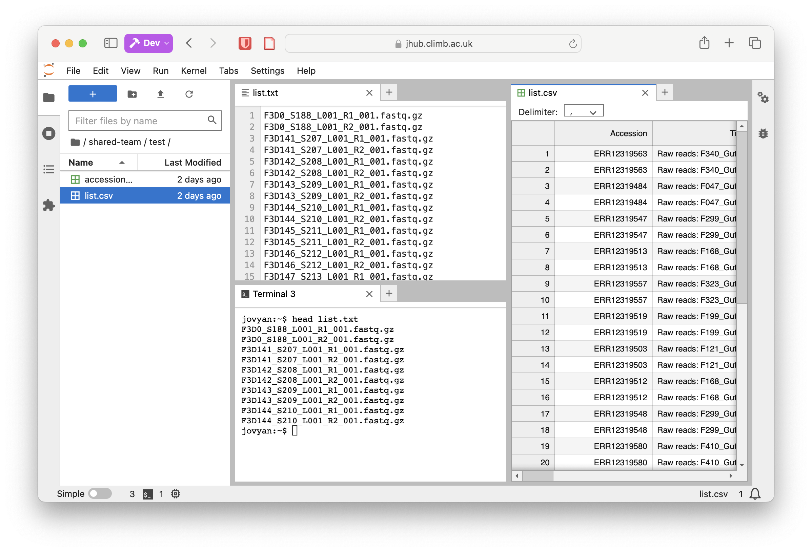
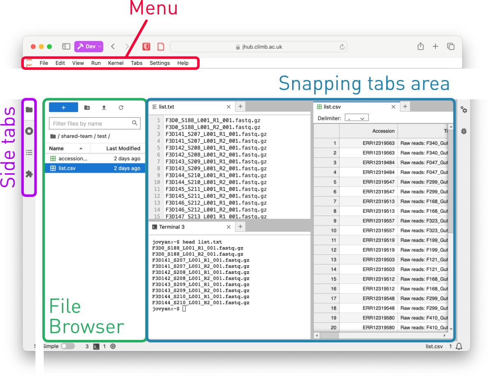

# Using the Jupyter Notebook Interface

The Jupyter notebooks are easy to use yet powerful. The interface, for example, allows to:

* Easily navigate the **file system**, to create, upload, download and manage files and directories.
* Have multiple tabs, that can be arranged and *snapped* to a corner, to a side, bottom or top of the "snapping area".
* Tabs can be:
    * One or more **terminal** tabs, to run commands and scripts.
    * One or more **notebook** tabs, to write and run code, and to create and manage documents.
    * One or more **text editor** tabs, to write and edit text files. You can directly edit the text (and save it) from the interface.
    * Built in preview for HTML files (for example, MultiQC reports), tables (csv, tsv, etc.), and images.

The interface consists of four main components:

1. The **menu bar**, where you can access settings (including font size etc.), and manage the notebook.
2. The side bar will allow you to select the appropriate side tab. 
3. The **side area**, which is by default set to the **File Browser**. From here you can navigate directories and upload/download files. You can quickly upload a file by dragging it from your computer and dropping it in the file browser.
    1. Right-clicking to a file will allow you to download it, rename it, or to "open it" with the appropriate application.
4. The **snapping tabs area**, where you can place all your open tabs, and arrange them as you like.

## Common tasks

### Quickly upload some files to the Notebook

1. Use the side bar (File Browser) to navigate to the appropriate location. Remember that your home directory is not a safe place for storage, and that you should use the `shared-team` directory for your data.
2. If appropriate, create a new sub directory (e.g. right click in the white area of the file browser and select "New Folder", then type a name for it)
3. On your local computer, open the directory with the files you want to upload.
4. Drag the files from your local computer and drop them in the file browser of the notebook interface.
5. If the file size is relevant you will get a warning. For very large uploads, you should consider using the S3 storage instead.

### Edit a file and save it

1. Use the side bar (File Browser) to navigate to the appropriate location.
2. Some files will open in an editor automatically, otherwise right click on the file and select **"Open with" -> "Editor"**.
3. When you edit the file, a dot (⚫️) will appear in the tab, indicating that the file has been modified.
4. Use `Ctrl + S` to save the file (or `Cmd + S` on macOS), or click the save button in the editor.

### Live preview of a (supported) file

1. Use the side bar (File Browser) to navigate to the appropriate location.
2. Right click on the file and select **"Open with" -> "Editor"**.
3. Now right-click again on the file and select **"Open with" -> "CSV Previe"** (or other supported preview: like Markdown, HTML...).
4. When you edit and **save** the file with the editor, the preview will update automatically.

💡 You can use a similar arrangement to keep, for example, a script editor on your left and a terminal to run the script on your right. 

### Using the Python notebook with custom libraries

1. Open a terminal tab.
2. Create a new environment with the requested libraries plus `ipykernel`, using `conda create -n EnvName ... ipykernel`. Suppose you want to create an environment called `dataexplorer` with Pandas, Seaborn, and Matplotlib, you would use `conda create -n dataexplorer pandas seaborn matplotlib ipykernel`.
3. Open the launcher, and you will see a new icon with the environment name under the Python Icon. Click on it to create a new notebook with the new environment.
4. From that notebook you will be able to `import pandas as pd`, for example.

See: [Using Jupyter](using-jupyter.md) for more details.