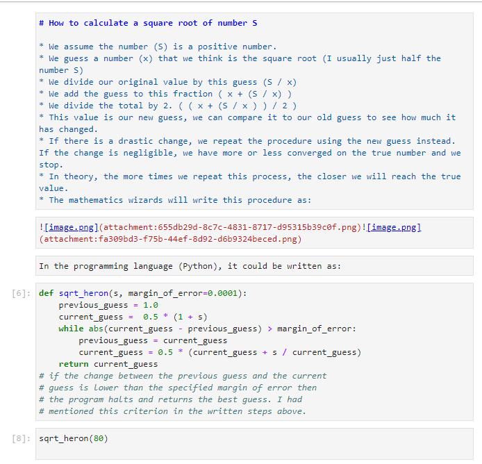
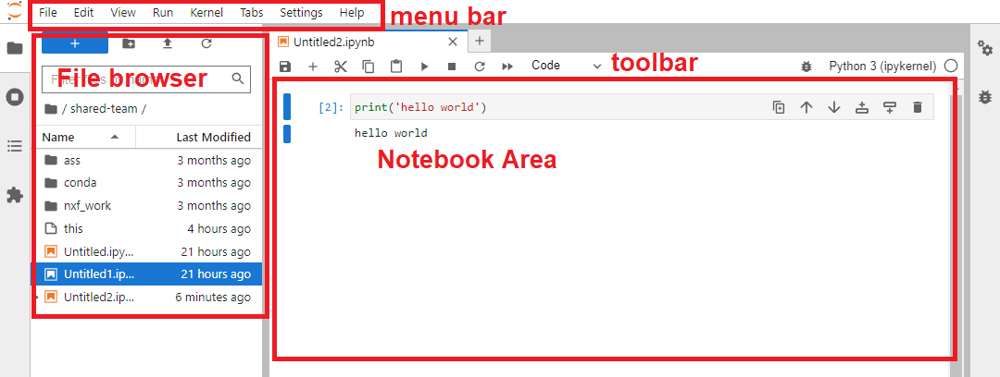
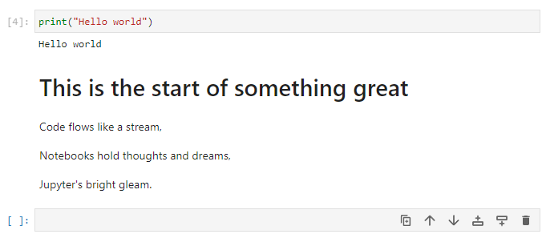

# Using Jupyter Notebooks

Jupyter Notebooks are a powerful and popular tool for interactive computing, data analysis, and data visualization. They allow you to create and share documents that contain live code, equations, visualizations, and explanatory text, making them an excellent choice for data scientists, researchers, and educators. In this tutorial, we'll walk you through the basics of Jupyter Notebooks and how to get started with them. [There is more detailed documentation here](https://jupyterlab.readthedocs.io/en/stable/user/running.html)

Jupyter Notebooks can look very handsome, with a mix of code and formatted text. Here is an example explaining how to calculate the square root of a number. 

**Unformatted (i.e. the input you would enter):**

**Formatted (i.e. the output you would see):**

The Jupyter Notebook interface consists of four main components:

* **Menu Bar**: The menu bar at the top contains various options for managing the notebook, such as saving, adding new cells, changing cell types, and more.
* **Toolbar**: The toolbar provides quick access to frequently used actions, like running cells, saving the notebook, and adding new cells.
* **File browser**: The file browser, allows you to navigate directories and upload/download files.
* **Notebook Area**: The notebook area is where you create and edit your notebook. Each notebook is divided into a series of cells, which can be of two main types: code cells and markdown cells.

*There is a detailed debugger panel on the right side as well.*

# Working with the Jupyter Notebook

You primarily interact with the notebook by writing and running *Code cells*. Code cells in Jupyter Notebooks are the areas where you can write, execute, and interact with live code. They are one of the fundamental building blocks of Jupyter Notebooks and are used to perform computations, run algorithms, manipulate data, and create visualizations. When you run a code cell, the code inside it is executed by the kernel associated with the notebook (e.g., IPython for Python code).

 To run a code cell, select it and either press the "Run" button in the toolbar or use the keyboard shortcut "Shift + Enter." The code will be executed, and the output (if any) will be displayed below the cell. Try this now with a simple "hello world" example.

In the grey box. Type `print("Hello world")` and press `Shift + Enter`. You should see the output below the cell. By pressing the plus button in the tool bar, you can add a new cell below the current one. Try this now.

You can also change the type of a cell from the toolbar. Try changing the type of the new cell to "Markdown" and typing some text (see the dropdown in the toolbar). Then run the cell to see the formatted text. 

<!-- prettier-ignore -->
!!! tip
    Markdown cells are used to add explanatory text, headings, images, links, and more to your notebook. You can use Markdown syntax to format the text. To render the formatted text, run the markdown cell.

## Saving and exporting your work

To save your notebook, use either the "Save" option from the menu bar or press "Ctrl + S" or "Cmd + S" (on Mac) keyboard shortcuts. To export your notebook in various formats (e.g., HTML, PDF, Python script), go to "File" -> "Save and export As" in the menu bar and select the desired format.

## Markdown formatting 

These are just some of the basic Markdown syntax elements you can use to format text. Markdown allows you to easily create headings, emphasize text, create links, add images, create lists, quote text, and even include code blocks for different programming languages.

| Markdown Syntax         | Output                          |
|------------------------|---------------------------------|
| `# Heading 1`          | # Heading 1                     |
| `## Heading 2`         | ## Heading 2                    |
| `### Heading 3`        | ### Heading 3                   |
| `**Bold Text**`        | **Bold Text**                   |
| `*Italic Text*`        | *Italic Text*                   |
| `~~Strikethrough~~`    | ~~Strikethrough~~               |
| `[Link](https://climb.ac.uk/)` | [Link](https://climb.ac.uk/) |
| ``   |     |
| `1. Item 1`            | 1. Item 1                       |
| `2. Item 2`            | 2. Item 2                       |
| `- Unordered List`     | - Unordered List                |
| `> Blockquote`         | > Blockquote                    |

## Additional Tips and Tricks

* You can reorder cells by clicking and dragging them to a new position.
* To delete a cell, select it and use the "Edit" -> "Delete Cells" option or press "Ctrl + Shift + Backspace."
* To change the type of a cell, use the dropdown menu in the toolbar and select either "Code" or "Markdown."
* Jupyter Notebooks support auto-completion, which can be triggered by pressing "Tab" while typing code.
* To get help on a function or object, append a question mark (?) at the end and run the cell.

## Advantages of Jupyter Notebooks 

* **Interactive Computing**: Jupyter Notebooks provide an interactive computing environment. Users can run code cells individually, making it easy to experiment, iterate, and visualize data in real-time.
* **Data Visualization**: Jupyter Notebooks support rich data visualization libraries like Matplotlib, Seaborn, and Plotly. This allows users to create interactive plots, charts, and graphs directly within the notebook.
* **In-line Markdown**: Notebooks support Markdown cells, allowing users to document their code and analyses with formatted text, images, links, and even equations using LaTeX syntax.
* **Shareability and Reproducibility**: Notebooks can be easily shared with others, facilitating collaboration and reproducibility. By sharing the code and output together, others can reproduce the same results and understand the analysis.
* **Code Modularity**: Notebooks allow breaking down complex analyses into smaller, more manageable code cells. This modularity makes the code easier to read, test, and maintain.
* **Kernel Support**: Jupyter Notebooks support multiple kernels, enabling users to work with different programming languages (Python, R, etc.) in the same environment.