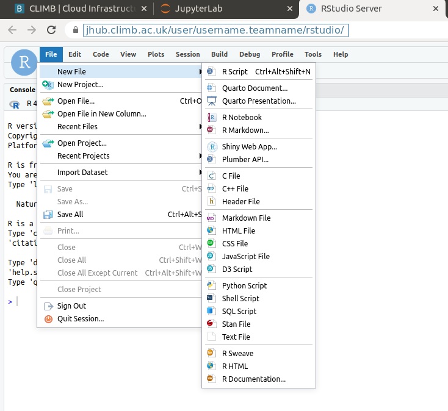
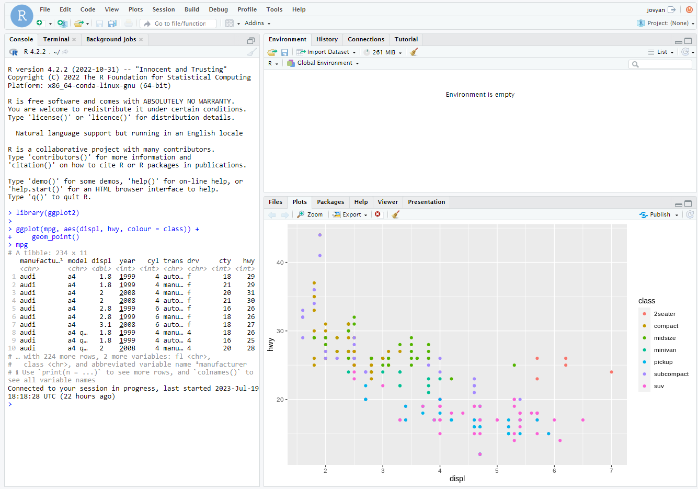

# Using RStudio

RStudio is an integrated development environment (IDE) specifically designed for the R programming language. It provides a user-friendly interface that simplifies the process of coding, debugging, data visualization, and data analysis using R. RStudio is available in both open-source and commercial editions.

RStudio was originally an interface to interactive with `R` programming language. Since July 2022, it is now known as Posit as they support other languages such as python. The main feature remains the same, to easily edit scripts and view input/ouput files. Our version of RStudio only supports the `R` programming language. Here are the top five features of RStudio:

* **Intuitive Code Editor**: RStudio provides an intuitive code editor with syntax highlighting, code completion, and code folding. These features make it easier to write, edit, and navigate through R code, reducing errors and improving coding efficiency.
* **Interactive Data Visualization**: RStudio has an integrated plot viewer that supports interactive and high-quality data visualizations using popular R packages like ggplot2 and plotly. Users can easily explore and customize visualizations to gain insights from data.
* **Workspace and Data Management**: RStudio offers a workspace panel that displays all the variables and data objects currently in memory. Users can inspect, manipulate, and remove objects directly from the workspace, making it easy to manage data and perform exploratory data analysis.
* **R Markdown Support**: RStudio has strong support for R Markdown, a format that allows users to create dynamic documents that combine R code, visualizations, and narrative text. This feature is beneficial for creating reproducible reports, research papers, and data-driven presentations.
* **Integrated R Console and Terminal**: RStudio includes a built-in R console that allows users to interactively execute R code and see the output in real-time. Additionally, it provides a terminal console for executing system commands and running scripts from the command line, making it a versatile tool for data analysis and workflow management.

If you are not familiar with `R` or RStudio you can find more information here: [https://education.rstudio.com/learn/beginner/ 
](https://education.rstudio.com/learn/beginner/ 
)
## How to start?

Both `R` and RStudio are already installed for you. You will find them under the “Notebooks” section of the Main Work Area. 


For pure access to `R` you can use the jupyter notebook. For access to RStudio, a separate tab will be opened:


1. **Editor** – This is where you can interactively write and edit your scripts.
2. **Console** – This is where your code can be run.
3. **Environment** – This is where all input/output objects can be viewed as either Data or Values.
4. **Output** – View plots, packages, help for package documentation.

You can Select “File” and “New File” to create and open a variety of file types:



## Installing packages

You can install packages which provide additional features and documentation to the base `R` packages. You can do this via the GUI or via the terminal like so:

```
install.packages(“ggplot2”)
```

Once a package is installed, you will need to load it:
```
library(ggplot2)
```

Now all of the features from `ggplot2` will be available to you.

All plots are highly customisable, you just need to know the right functions and layering them !

<!-- prettier-ignore -->
!!! tip
    Regarding R version control – we will only be providing the newest version of R so please do check the version for your scripts.

Here is a simple example of a plot using the `ggplot2` package:

```
library(ggplot2)
mpg
ggplot(mpg, aes(displ, hwy, colour = class)) + 
  geom_point()
```




## Other useful packages

* `BactDating` – time scaled phylogenies
* `ggtree` – visualising phylogenetic trees
* `gtsummary` – presentation ready data summary and analytic results tables
* `lme4` – Linear Mixed-Effects Models
* `phyloseq` – Handling and analysis of high-throughput microbial communities
* `qiime2R` – importing Qiime output tables
* `RcolorBrewer` – ColorBrewer Palettes
* `tidyverse` - collection of R packages designed for data science
* `VennDiagram` – Generates High-Resolution Venn and Euler Plots

There are many “cheat sheets” available for [individual packages which you can find here.](https://raw.githubusercontent.com/rstudio/cheatsheets/main/data-visualization-2.1.pdf 
)


## How to upload file to Rstudio from local machine

1. Open the Rstudio session.


2. Click on the **Upload** tab in the **Output** section.


3. A pop-up windon names *Upload Files* will be open.
 

4. Click on the  *Choose file* and browse to the location of the file within the local machine and then select the file you want to upload and click on "Open".


4. Click **OK**

5. Now you can see the file in the **Output** section.
