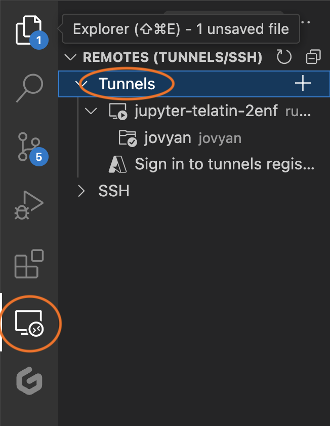

# Editing with VS Code

Visual Studio Code, or VS Code, is a very popular [IDE](https://aws.amazon.com/what-is/ide/). 
In this tutorial we will see how to use VS code to connect to your CLIMB Jupyter Notebook

<!-- prettier-ignore -->
!!! Prerequisites
    We will assume you are a **VS Code** user already and you can install extensions and that you have a **GitHub account**.
    If you are not, you might be interested in [learning why](https://code.visualstudio.com/learn) it's so popular, and maybe [download](https://code.visualstudio.com/Download) it and give it ago.


## Install "Tunnels"

Inside your local VS Code, install the extension `Remote - Tunnels` by Microsoft.

After you install it, go to your *Remotes* tab and login using your GitHub account (you should see a *Sign in using your GitHub account* item in the menu).

See the image below to locate the "Remotes" tab.

{ width=600 }

## Install VS Code in your CLIMB terminal

First, you will need to download *VS Code* also in your CLIMB notebook. This step has only to be done the first time.

```console
# SETUP (this has to be done once)
cd $HOME
# Download VS Code (this has to be done once)
wget -O code.tgz "https://code.visualstudio.com/sha/download?build=stable&os=cli-alpine-x64"
# Expand the package (this has to be done once)
tar xvfz code.tgz
```

Now, you can run a tunnel from your CLIMB terminal, with this command:

```console
~/code tunnel
```

This command will start an *interactive* configuration walk-through so keep an eye at the terminal and 
answer the questions / follow the instructions.

You will have to follow the instructions which will involve:

1. Selecting GitHub as provider
2. Following the provided link and pasting there the code that will appear on your CLIMB notebook
3. Authorize the connection
4. Return to your CLIMB notebook terminal, and give a name to the connection

Here a typical example of the connection setup:

```text
*
* Visual Studio Code Server
*
* By using the software, you agree to
* the Visual Studio Code Server License Terms (https://aka.ms/vscode-server-license) and
* the Microsoft Privacy Statement (https://privacy.microsoft.com/en-US/privacystatement).
*
✔ How would you like to log in to Visual Studio Code? 
· Github Account

To grant access to the server, please log into https://github.com/login/device and use code 420D-0000

✔ What would you like to call this machine? · jupyter-telatin-2enf
[2024-03-18 12:25:40] info Creating tunnel with the name: jupyter-telatin-2enf

Open this link in your browser https://vscode.dev/tunnel/jupyter-telatin-2enxf
```

When you are done, you can either click on the link provided on your terminal, or refresh
your tunnels list in your *local* VS Code, and as shown in the image above, you should see the
`jupyter-groupname-id` (or custom name you gave)