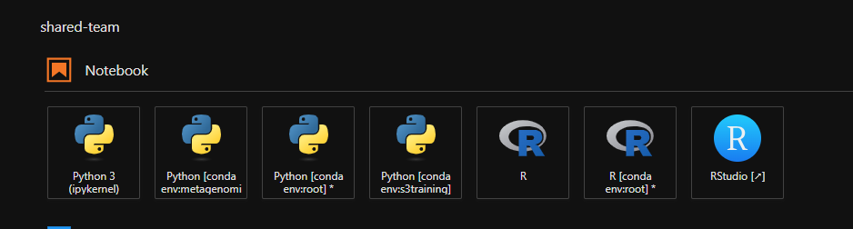

# Transferring programmatically between an S3 bucket and CLIMB-BIG-DATA notebook server (using python)

## Creating an environment

In the [terminal](../notebook-servers/using-the-terminal.md), create a new environment called `s3training` and activate it:

```bash
conda create --solver libmamba -y -n s3training ipykernel
conda activate s3training
```

Once this is complete, you should see the environment available as a notebook in the Launcher window (`File > New Launcher`)



Click the tile and open a new Jupyter notebook. You should see s3training in as the name of the kernel in the top right of the notebook.


## Uploading and downloading a file to S3

Let's create a test file to up load to a bucket. In the Jupyter notebook, create a new cell and add the following:

```
!source ~/.bashrc
!echo "Bless this mess" > s3test.txt
```

This creates a text file called `s3test.txt` with the text "Bless this mess".

<!-- prettier-ignore -->
!!! tip
    The ! allows us to run a shell command in the notebook. You could also do this in the terminal directly.

We will need to `boto3` and `dotenv` Python module which we can install in a new cell with

```
pip install boto3 python-dotenv
```

Create another cell and add the following script. This will upload the file `s3test.txt` to the bucket. You will need have a bucket already created in Bryn. If you don't have one, you can create one in the [Bryn dashboard](https://bryn.climb.ac.uk/dashboard/). The script below has MY OWN bucket 'quadram-bioinfo-training' as the BUCKET_NAME, you will need to change this to the name of YOUR bucket.

```python
import boto3
import os 
from dotenv import load_dotenv

dotenv_path = '/home/jovyan/.s3cfg' # ~/.s3cfg is the default location for the s3 config file
load_dotenv(dotenv_path=dotenv_path)

BUCKET_NAME = 'quadram-bioinfo-training'

def upload_file_to_s3(file_name, bucket):
    object = s3.Object(bucket, file_name)
    object.put(Body=open(file_name, 'rb'))

def download_file_from_s3(key, bucket, output_path):
    object = s3.Object(bucket, key)
    with open(output_path, 'w') as f:
         f.write(object.get()['Body'].read().decode('utf-8'))
    
# Create a resource using your S3 credentials
s3 = boto3.resource('s3',
  endpoint_url = 'https://s3.climb.ac.uk',
  aws_access_key_id = os.environ.get("access_key"),
  aws_secret_access_key = os.environ.get("secret_key")
)

# Upload our file to the bucket 
upload_file_to_s3('s3test.txt', BUCKET_NAME)

# Let's print the output of the bucket
print('Objects:')
my_bucket = s3.Bucket(BUCKET_NAME)    
for my_bucket_object in my_bucket.objects.all():
    print(my_bucket_object.key)

# Let's download our file from the bucket to another file
download_file_from_s3('s3test.txt', BUCKET_NAME, 's3_backagain.txt')
```

This Python code uses the `boto3` library to interact with CLIMB's S3, which is a cloud storage service. The code defines two functions: `upload_file_to_s3()` and `download_file_from_s3()`. The `upload_file_to_s3()` function uploads a file to the specified S3 bucket, while the `download_file_from_s3()` function downloads a file from the specified S3 bucket to a local file.

The code creates a resource object that connects to the S3 service using the specified endpoint URL and access keys. The `os.environ.get()` function is used to retrieve the values of the access key and secret key from the environment variables. These keys are used to authenticate the connection to the S3 service.

The code then uploads a file called `s3test.txt` to the specified S3 bucket using the `upload_file_to_s3()` function. It then prints the keys of all objects in the bucket using the `my_bucket.objects.all()` function, to show the file has been uploaded;. 

Finally, the code downloads the `s3test.txt` file from the S3 bucket to a local file called `s3_backagain.txt` using the `download_file_from_s3()` function.

As the `s3_backagain.txt` file, is just a copy of the original `s3test.txt` with a different name, it should contain the text "Bless this mess". i.e.

```
!cat 's3_backagain.txt'
```

Should show

```
Bless this mess
```

## Reading directly from S3
You can read directly with the `s3_client` object, without having to download the file to your notebook. 
For example, to read the file we just uploaded:

```python
object = s3.Object(BUCKET_NAME, 's3test.txt')
print(object.get()['Body'].read().decode('utf-8'))
```

Should return 
```
Bless this mess
```
