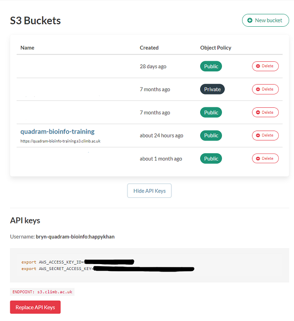

# Transferring data from CLIMB VMs to S3 Buckets

This is a dedicated guide if you are moving from using CLIMB VMs to the new notebook model. Here we will show you how to get `s3cmd` setup on your VM, create a bucket, and how to transfer data from your VM to S3.

<!-- prettier-ignore -->
!!! tip
    This will work on any Linux machine, not just CLIMB VMs.

## What is S3?
S3 is a cloud-based object storage service. An S3 bucket is a fundamental container for storing and organizing data in S3. It is conceptually similar to a directory or folder in a file system, but it is designed to store objects (files) in a highly scalable and durable manner.

## Installing s3cmd

You will need to install `s3cmd` on your CLIMB VM. You can do this using python pip. I have installed it in a Conda environment but you can install `s3cmd` anywhere. For example,

```bash
conda create -n s3cmd -y
conda activate s3cmd
pip install -U s3cmd
```

## Configuring s3cmd

You will need to configure `s3cmd` to use your CLIMB S3 credentials. You can do this by running the following command:

```bash
s3cmd --configure
```

This will then take you through a series of prompts. You can accept the defaults for all of these except for the following:

```bash
Access Key: Your access key, as displayed in BRYN
Secret Key: Your access key, as displayed in BRYN
S3 Endpoint [s3.amazonaws.com]: s3.climb.ac.uk
DNS-style bucket+hostname:port template for accessing a bucket [%(bucket)s.s3.amazonaws.com]: %(bucket)s.s3.climb.ac.uk
```

Your access and secret keys are unique to you and [can be found in BRYN](https://bryn.climb.ac.uk/teams/V83D0V0XNKZ/buckets).
These are available in the *S3 buckets* section of BRYN. Click on the *API keys* button to reveal your keys.



Step through all the other prompts. If the configuration is successful, you should be able to list your buckets, with `s3cmd ls`

```bash
s3cmd ls
```

## Creating a bucket

If you have not created a bucket for your data, you should do so now in the [BRYN interface](https://bryn.climb.ac.uk/teams/V83D0V0XNKZ/buckets). You can do this by clicking on the *New bucket* button.


The create bucket interface will then appear. You should give your bucket a name. You can also choose to make your bucket public.


## A worked example

Now with `s3cmd` ready to go, I will demonstrate how to transfer data with a worked example. This worked example uses my own (important) data, that I am transferring from my VM to S3. I have a output of a recent run of ClonalFrameML on my VM, and I want to transfer it to S3.

We will need to correct name for our bucket which we can see using `s3cmd ls`

```
s3cmd ls
```

Will give a list of buckets like;

```
2023-07-21 08:50  s3://quadram-bioinfo-training
```

Here is the directory listing of my data I want to transfer:


```bash
(s3cmd) ubuntu@chomp:~/scratch/nabil_back$ ls clonal_heidl/ -Rl
clonal_heidl/:
total 3513600
-rwxr-xr-x 1 ubuntu ubuntu 3546608056 Apr 14  2020 clean.full.aln
-rwxr-xr-x 1 ubuntu ubuntu   37881459 Apr 14  2020 clonal.ML_sequence.fasta
-rwxr-xr-x 1 ubuntu ubuntu      66719 Apr 14  2020 clonal.em.txt
-rwxr-xr-x 1 ubuntu ubuntu      15947 Apr 14  2020 clonal.importation_status.txt
-rwxr-xr-x 1 ubuntu ubuntu      32169 Apr 14  2020 clonal.labelled_tree.newick
-rwxr-xr-x 1 ubuntu ubuntu    9671724 Apr 14  2020 clonal.position_cross_reference.txt
-rwxr-xr-x 1 ubuntu ubuntu      28846 Apr 14  2020 iqtree_fast.treefile
```

To transfer this to S3, we can use the `s3cmd sync` command. This will transfer the data to S3, and will only transfer files that have changed.
The syntax for s3cmd sync is `s3cmd sync <source> <destination>`. In this case, we want to transfer the data from our VM to S3, so we will use the following command:

```bash
s3cmd sync clonal_heidl/  s3://quadram-bioinfo-training/clonal_heidl/
```

<!-- prettier-ignore -->
!!! note
    The destination is the bucket address we saw earlier, with `s3cmd ls`.

<!-- prettier-ignore -->
!!! warning
    The last slash for folder name after the bucket name is important. It is how `s3cmd` knows you want to transfer into a folder. If you miss this off, you will get an error message like this:
    `Parameter problem: Destination S3 URI must end with '/' (ie must refer to a directory on the remote side).`


The transfer will now begin. You will see a progress bar for each file that is transferred.

```bash
(s3cmd) ubuntu@chomp:~/scratch/nabil_back$ s3cmd sync clonal_heidl/  s3://quadram-bioinfo-training/clonal_heidl/
upload: 'clonal_heidl/clean.full.aln' -> 's3://quadram-bioinfo-training/clean.full.aln'  [part 1 of 226, 15MB] [1 of 8]
 15728640 of 15728640   100% in    1s     9.95 MB/s  done
    .................
Done. Uploaded 3594366897 bytes in 330.1 seconds, 10.38 MB/s.
```

Once the transfer is complete, you can check that the data is in S3 by listing the contents of the bucket. For me, I do the following:

```bash
s3cmd ls s3://quadram-bioinfo-training/clonal_heidl/
```

Shows (for me):
```
2023-07-24 13:51   3546608056  s3://quadram-bioinfo-training/clonal_heidl/clean.full.aln
2023-07-24 13:51     37881459  s3://quadram-bioinfo-training/clonal_heidl/clonal.ML_sequence.fasta
2023-07-24 13:51        66719  s3://quadram-bioinfo-training/clonal_heidl/clonal.em.txt
2023-07-24 13:51        15947  s3://quadram-bioinfo-training/clonal_heidl/clonal.importation_status.txt
2023-07-24 13:51        32169  s3://quadram-bioinfo-training/clonal_heidl/clonal.labelled_tree.newick
2023-07-24 13:51      9671724  s3://quadram-bioinfo-training/clonal_heidl/clonal.position_cross_reference.txt
2023-07-24 13:51        28846  s3://quadram-bioinfo-training/clonal_heidl/iqtree_fast.treefile
```

To check one of my text files are ok, I can just read the file back to the screen (i.e. STDOUT) using `s3cmd get`

```bash
s3cmd get s3://quadram-bioinfo-training/clonal_heidl/clonal.em.txt --no-progress  - | more
```

Which will give me:

```
Parameter       Posterior Mean  Posterior Variance      a_post  b_post
R/theta 0.0829423       4.28704e-06     1604.7  19347.2
1/delta 0.000825935     4.25106e-10     1604.7  1.94289e+06
nu      0.0102149       5.26024e-09     19836.3 1.9419e+06
ERR034167       8.68129e-06     1.8105e-12      41.6265 4.79497e+06
ERR212540       1.5101e-05      3.14957e-12     72.4034 4.79462e+06
.....
```

Success! My files are now on the S3 bucket.

# Fetching files from the S3 bucket
You can easily fetch files from the S3 bucket using `s3cmd get`. For example, to get the `clonal.em.txt` file we uploaded earlier, we can use the following command:

```bash
s3cmd get s3://quadram-bioinfo-training/clonal_heidl/clonal.em.txt
```

If we want to download the file to a different name, we can specify this as another parameter. For example, to download the file to `new_clonal.em.txt`, we can use the following command:

```bash
s3cmd get s3://quadram-bioinfo-training/clonal_heidl/clonal.em.txt  new_clonal.em.txt
```

To download the entire folder back, we can use `s3cmd sync` in reverse. Note here, that the destination is now the local folder, and the source is now the S3 bucket. For example, to download the entire folder back, we can use the following command:

```bash
s3cmd sync s3://quadram-bioinfo-training/clonal_heidl/ new_clonal_heidl/
```

Which will then start a transfer for the entire folder, to the new location
```
download: 's3://quadram-bioinfo-training/clonal_heidl/clean.full.aln' -> 'new_clonal_heidl/clean.full.aln'  [1 of 8]
  275906560 of 3546608056     7% in    3s    70.84 MB/s
..........
```

You can upload/download data programmatically using `Python`, [see the documentation here.](program-s3-fetch.md)
