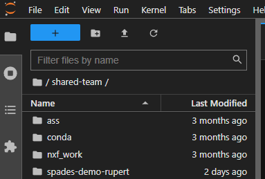

# Transferring from your local machine to and from your CLIMB-BIG-DATA notebook server

Transfer between your local machine to the notebook server can be done in a number of ways:

* Using the file upload in the browser - for Windows, MacOSX and Linux
* Using the command line - for Linux and MacOSX

## Using the file upload in the browser

The file browser and File menu in JupyterLab allow you to manage files and directories on their system. You can perform various actions, such as opening, creating, deleting, renaming, downloading, copying, and sharing files and directories. The file browser is accessible from the left sidebar under the Files tab.



In the File menu, you can find options like "New" and "Save All" to create new files and save changes to multiple files simultaneously.

To open a file, you can double-click on its name in the file browser, and it will open in the default viewer/editor. Alternatively, they can drag a file into the main work area to create a new tab.

JupyterLab supports multiple viewers/editors for various file types. For example, a Markdown file can be opened either in a text editor or as rendered HTML. Additionally, JupyterLab extensions can add new viewers/editors for specific file types. To open a file using a non-default viewer/editor, you can right-click on its name in the file browser and select the desired viewer/editor from the "Open With…" submenu.

There are complete step-by-step instructions on how to upload files to JupyterLab [here](https://jupyterlab.readthedocs.io/en/stable/user/files.html).

## Using the command line

You can use certain Linux commands copy between your local machine and your notebook server. You must do this from within your notebook server. This can be done with tools such as [`scp`](../reference/scp.md) and [`rsync`](../reference/rsync.md).

From within notebook server terminal, I can use [`scp`](../reference/scp.md) to copy files from my local machine to the notebook server. For example, to copy a file called `some_file` from my local machine to the notebook server, I would use the following command:

```
jovyan:$ scp nabil@101.123.112.1:some_file .
```

Where `101.123.112.1` is the IP address of my local machine. The `.` at the end of the command means that the file will be copied to the current directory. If I wanted to copy the file to a different directory, I would specify the path to that directory instead of `.`.

<!-- prettier-ignore -->
!!! warning
    This requires access to a local machine (i.e. your local machine should be visible to CLIMB-BIG-DATA) and your local machine has SSH enabled.

For more information about `scp` in general please read the page about [`scp`](../reference/scp.md).
