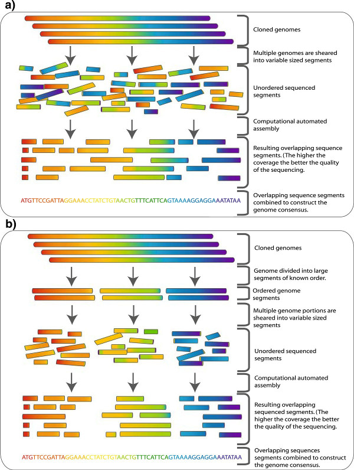
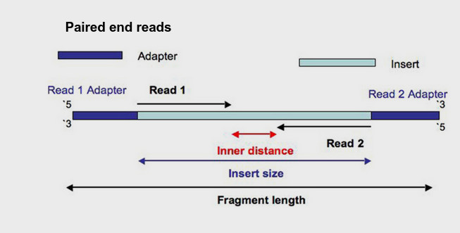

# What is a genome assembler doing?

Genome assemblers assume the following about sequenced reads:

* Reads are resolved into nucleotide bases (ATGC & ambiguous base calls)
* Reads are randomly distributed across the target DNA, and
* Reads are represent an oversampling of the target DNA, such that individual reads repeatedly overlap
* Genome assemblers calculate overlaps between reads and (usually) represent as a graph/network. Then "walk" the graph to determine the original sequence.

See [Torsten Seemann’s slides on de novo genome assembly](https://tinyurl.com/torstaseembler)

> Whole genome shotgun sequencing: Genome is sheared into small approximately equal sized fragments which are subsequently small enough to be sequenced in both directions followed by cloning. The cloned sequences (reads) are then fed to an assembler (illustrated in Figure 2). b To overcome some of the complexity of normal shotgun sequencing of large sequences such as genomes a hierarchical approach can be taken. The genome is broken into a series of large equal segments of known order which are then subject to shotgun sequencing. The assembly process here is simpler and less computationally expensive. From [Commins, Toft and Fares 2009](http://dx.doi.org/10.1007/s12575-009-9004-1)
 
## What is R1 and R2?
Just as a reminder, many sequencing library preparation kits include an option to generate so-called "paired-end reads".  Intact genomic DNA is sheared into several million short DNA fragment.  Individual reads can be paired together to create paired-end reads, which offers some benefits for downstream bioinformatics data analysis algorithms.  The structure of a paired-end read is shown here.

* "Read 1", often called the "forward read", extends from the "Read 1 Adapter" in the 5′ – 3′ direction towards "Read 2" along the forward DNA strand.
* "Read 2", often called the "reverse read", extends from the "Read 2 Adapter" in the 5′ – 3′ direction towards "Read 1" along the reverse DNA strand.

## How genome assemblers fail perfection
In theory, Genome assembly software with perfect reads of good length will reconstruct the genome verbatim 

However, Sequencing platform have errors (and cause errors downstream): 

* Struggle with GC rich and/or AT rich DNA.
* Have lower read quality towards the end of reads (5', 3' or both ends)
* Have difficulty reading homopolymers (e.g. AAAAA or TTTTTTT) accurately
* **Have read lengths that does not span repeated sequences in the genome**

 

* Repeats: A segment of DNA that occurs more than once in the genome
* Read length must span the repeat

### Outcomes of your final contigs

 

> Mate-pair signatures for collapse style mis-assemblies. (a) Two copy tandem repeat R shown with properly sized and oriented mate-pairs. (b) Collapsed tandem repeat shown with compressed and mis-oriented mate-pairs. (c) Two copy repeat R, bounding unique sequence B, shown with properly sized and oriented mate-pairs. (d) Collapsed repeat shown with compressed and mis-linked mate-pairs. From [https://doi.org/10.1186%2Fgb-2008-9-3-r55](https://doi.org/10.1186%2Fgb-2008-9-3-r55)

### How to span repeats
* Long reads (ONT, Pacbio)
* Long reads (Sanger)
* Optical mapping
* Hi-C
* Or just don’t! 