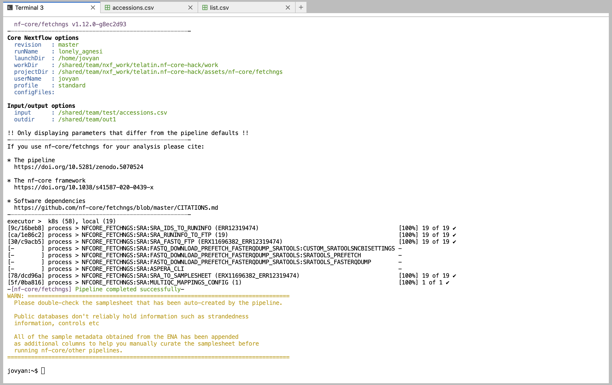

# Running nf-core pipelines

## What are nf-core pipelines?

[nf-core](https://nf-co.re/) is an organisation backing an international effort to create high-quality,
reproducible pipelines written in [Nextflow](https://nextflow.io/).

Some examples of nf-core pipelines include:

* [nf-core/fetchngs](https://nf-co.re/fetchngs/): to download raw datasets from public repositories (ENA, SRA...)
* [nf-core/rnaseq](https://nf-co.re/rnaseq/): to perform a differential expression analysis of RNA-Seq datasets
* [nf-core/ampliseq](https://nf-co.re/ampliseq/): to analyse metabarcoding (16S, ITS...) experiments (mostly based on Qiime2)
* [nf-core/taxprofiler](https://nf-co.re/taxprofiler/): to run multiple taxonomy profiling tools on a metagenomics dataset
* [nf-core/mag](https://nf-co.re/mag/): to assemble and bin whole metagenome sequencing runs

* See the full list [online](https://nf-co.re/pipelines).

* 💡 See also [Using Nextflow](../../notebook-servers/using-nextflow)

## How to run a nf-core pipeline?

There is a very good [documentation](https://nf-co.re/docs) available from the nf-core website, and 
even a great set of video tutorials.

A first attempt of running a pipeline should be using its *test* profile. This means that the pipeline will
try to analyse some test data known to work, and after getting a successful ending we can go further and try with our own data.

The general syntax is:
```text
nextflow run nf-core/<pipeline_name> -r <version> -profile test --outdir  /shared/team/<output-dir>
```

Where:

* `<pipeline_name>` is of course the actual pipeline you want to run
* `<version>` is the revision you want to use (this is important and will ensure reproducibility, check the pipeline website to see the last version)
* `<output-dir>` where Nextflow will save the files. **NOTE** that your home directory will not work!

For example, to test the `rnaseq` pipeline:

```console
nextflow run nf-core/rnaseq -r 3.14.0 -profile test --outdir /shared/team/test-out-rnaseq
```

## An example: fetchngs

`nf-core/fetchngs` is a pipeline to download a set of NGS output from public repositories such as [NCBI Short Reads Archive](https://www.ncbi.nlm.nih.gov/sra).

We can use it as a first example pipeline as its input is a simple text file with a list of accession codes.

Remembering that Nextflow pipelines will not have access to any file saved in your home directory, we can create an input file like:

```console
mkdir -p /shared/team/download-lists/
echo -e "ERR12319563\nERR12319484\nERR12319547" > /shared/team/download-lists/test.csv
```

<!-- prettier-ignore -->
!!! Edit the list
    The `echo` command created a list with three accession numbers from the command line, 
    but you can use the handy text editor built-in in the CLIMB notebook to create a new file.
    It's important to use the `csv` extension though.

```bash
# The \ in the command allows to break a command in multiple lines
# If you type the command in a single line, do NOT type the "\"s

nextflow run nf-core/fetchngs -r 1.12.0 \
   --input /shared/team/download-lists/test.csv \
   --outdir /shared/team/fetchngs-out/
```

Example execution:



## S3 buckets

A very handy feature of Nextflow, is that it can read and write to S3 buckets.

If we want to save the output of the nf-core/fetchngs pipeline to a CLIMB S3 bucket 
(suppose you have a bucket called "ngs-files"),
we can simply change the output path to something like:

```bash
# The \ in the command allows to break a command in multiple lines
# If you type the command in a single line, do NOT type the "\"s

nextflow run nf-core/fetchngs -r 1.12.0 \
   --input /shared/team/download-lists/test.csv \
   --outdir s3://ngs-files/fetchngs-output/
```